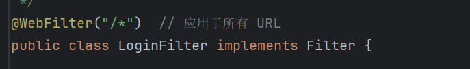
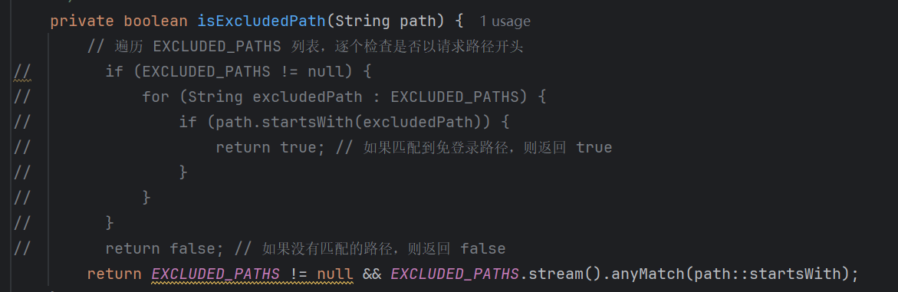

# Filter练习

> 作业探讨了**JavaWeb**应用中的**过滤器技术**，特别是针对**用户登录验证**的实现。内容包括**请求拦截与重定向**机制、**会话验证**、以及如何通过**过滤器配置**来区分公共资源与需登录访问的资源。作业中还涵盖了通过**Session管理**用户的登录状态，以及对**Web请求路径的排除列表**的管理策略。该作业具体实现了对登录页面、注册页面及公共资源的访问控制，确保未登录用户被重定向至登录页面，强化了Web应用的**安全性与用户体验**。

------

### 1. 创建一个名为`LoginFilter`的类，实现 `javax.servlet.Filter` 接口

> 

### 2. 使用 `@WebFilter` 注解配置过滤器,使其应用于所有 URL 路径 ("/*")。

> 

### 3. 在 `doFilter` 方法中实现

> 1. 检查当前请求是否是对登录页面、注册页面或公共资源的请求。如果是,则允许请求通过。
>
>    
>
> 2. 如果不是上述情况,检查用户的 session 中是否存在表示已登录的属性(如 "user" 属性)。如果用户已登录,允许请求继续。 如果用户未登录,将请求重定向到登录页面
>    
>    
>

### 4. 创建一个排除列表,包含不需要登录就能访问的路径(如 "/login", "/register", "/public")。

> 

### 5. 实现一个方法来检查当前请求路径是否在排除列表中。

> 

### 6. 额外功能

> 1. **注册功能**
>
> 注册功能允许用户创建新账号，将其用户名和密码存储在数据库中。
>
> **附加功能描述**：
>
> - 通过注册表单，用户可以创建新账户。
> - 用户提交的**用户名和密码**将**通过 JDBC** 插入到数据库中。
>
> **页面展示：**
>
> 
>
> 
>
> 2. **登录功能整合 JDBC 验证**
>
> 用户输入用户名和密码后，系统会从数据库中查询相应的用户信息，以**验证用户登录**的凭证。
>
> **附加功能描述**：
>
> - 系统通过 JDBC 从数据库查询用户凭证。
> - 如果凭证正确，允许用户登录，否则显示错误信息。
>
> **页面展示：**
>
> 
>
> 
>
> 
>
> 3. **登出功能**
>
> 登出功能允许用户主动退出登录，清除会话信息，并返回到登录页面。
>
> **附加功能描述**：
>
> - 当用户点击登出按钮时，系统会清除用户的 `session` 信息。
> - 用户登出后**重定向到登录页面**，并显示登出成功的消息。
>
> **页面展示：**
>
> 
>
> 

------

> [!IMPORTANT]
>
> **总结：**本次作业主要实现了一个登录验证过滤器，旨在检查用户的登录状态并对未登录用户进行重定向。通过创建 `LoginFilter` 类并实现 `javax.servlet.Filter` 接口，详细描述了过滤器的基本功能和逻辑。代码中包含了对请求路径的判断，排除了一些公共资源、登录和注册页面，并通过检查用户的会话属性和“记住我”功能，来决定是否放行请求或重定向到登录页面。此外，作业还强调了日志记录的重要性，通过使用 `Logger` 来跟踪请求路径和方法，增强了调试的便利性。整篇作业结合了Java Web开发中的会话管理和过滤器技术，展示了如何通过过滤器机制提高Web应用的安全性与用户体验，具有较高的实用价值和学习意义。

