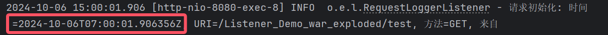
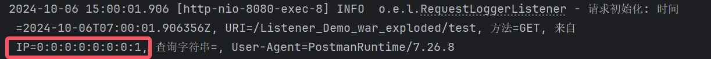
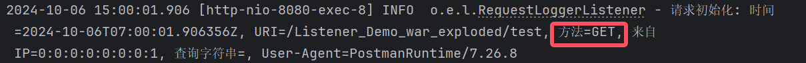
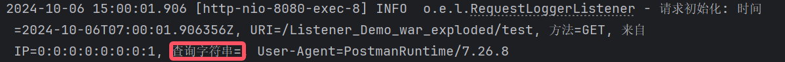
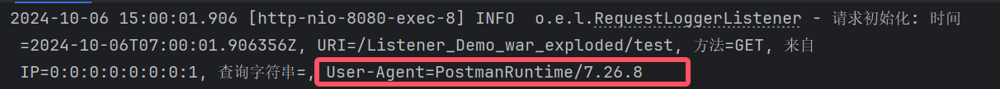
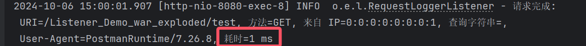
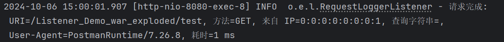

# Listener练习

> 作业探讨了**JavaWeb**应用中的**请求日志记录技术**，重点实现了基于**ServletRequestListener**的日志记录功能。内容包括如何捕获**请求时间**、**客户端 IP 地址**、**请求方法**（如 GET 和 POST）、**请求 URI**、**查询字符串**、**User-Agent**以及**请求处理时间**。作业中详细说明了如何在请求开始时记录初始时间，并在请求结束时计算处理时间，以便全面了解请求的处理效率。此外，作业还实现了一个简单的测试 Servlet，用于验证日志记录功能，确保每次请求的信息都被准确记录。日志采用清晰的格式，便于后续分析和监控，增强了Web应用的**可维护性和安全性**。通过此作业的实现，提升了对用户请求的透明度，为后续性能优化和问题排查奠定了基础。

------

### 1. 实现一个 ServletRequestListener 来记录每个 HTTP 请求的详细信息。

> 代码示例：
>
> ```
> package com.example.listener;
> 
> import org.slf4j.Logger;
> import org.slf4j.LoggerFactory;
> 
> import javax.servlet.ServletRequestEvent;
> import javax.servlet.ServletRequestListener;
> import javax.servlet.annotation.WebListener;
> import javax.servlet.http.HttpServletRequest;
> import java.time.Instant;
> 
> /**
>  * @ClassName RequestLoggerListener
>  * @Description ServletRequestListener 实现类，用于记录每个 HTTP 请求的详细信息，包括请求时间、客户端 IP、请求方法、URI、查询字符串、User-Agent 以及请求处理时间。
>  * @Author 示例开发者
>  * @Date 2024/10/06
>  */
> @WebListener
> public class RequestLoggerListener implements ServletRequestListener {
> 
>     // 日志记录器，遵循阿里巴巴的命名规范，使用 LoggerFactory 获取 logger 实例
>     private static final Logger logger = LoggerFactory.getLogger(RequestLoggerListener.class);
> 
>     // ThreadLocal 用于存储每个请求的开始时间，保证线程安全
>     private ThreadLocal<Long> startTime = new ThreadLocal<>();
> 
>     /**
>      * 请求初始化时触发，记录请求的初始信息
>      * @param sre ServletRequestEvent 事件对象，包含请求的相关信息
>      */
>     @Override
>     public void requestInitialized(ServletRequestEvent sre) {
>         HttpServletRequest request = (HttpServletRequest) sre.getServletRequest();
> 
>         // 记录请求开始处理时间
>         startTime.set(System.currentTimeMillis());
> 
>         // 请求时间，采用 ISO-8601 格式
>         String requestTime = Instant.now().toString();
> 
>         // 获取客户端 IP 地址
>         String clientIp = request.getRemoteAddr();
> 
>         // 获取请求方法 (GET, POST 等)
>         String method = request.getMethod();
> 
>         // 获取请求的 URI
>         String requestUri = request.getRequestURI();
> 
>         // 获取查询字符串（如果有）
>         String queryString = request.getQueryString() == null ? "" : request.getQueryString();
> 
>         // 获取 User-Agent 头信息
>         String userAgent = request.getHeader("User-Agent");
> 
>         // 记录日志，采用占位符格式，确保日志信息清晰易懂
>         logger.info("请求初始化: 时间={}, URI={}, 方法={}, 来自 IP={}, 查询字符串={}, User-Agent={}",
>                 requestTime, requestUri, method, clientIp, queryString, userAgent);
>     }
> 
>     /**
>      * 请求销毁时触发，记录请求的完成信息并计算处理时间
>      * @param sre ServletRequestEvent 事件对象，包含请求的相关信息
>      */
>     @Override
>     public void requestDestroyed(ServletRequestEvent sre) {
>         HttpServletRequest request = (HttpServletRequest) sre.getServletRequest();
> 
>         // 计算请求处理时间，单位为毫秒
>         long processingTime = System.currentTimeMillis() - startTime.get();
> 
>         // 获取请求的 URI
>         String requestUri = request.getRequestURI();
> 
>         // 获取请求方法 (GET, POST 等)
>         String method = request.getMethod();
> 
>         // 获取客户端 IP 地址
>         String clientIp = request.getRemoteAddr();
> 
>         // 获取查询字符串（如果有）
>         String queryString = request.getQueryString() == null ? "" : request.getQueryString();
> 
>         // 获取 User-Agent 头信息
>         String userAgent = request.getHeader("User-Agent");
> 
>         // 记录日志，输出请求完成后的详细信息
>         logger.info("请求完成: URI={}, 方法={}, 来自 IP={}, 查询字符串={}, User-Agent={}, 耗时={} ms",
>                 requestUri, method, clientIp, queryString, userAgent, processingTime);
> 
>         // 清除 ThreadLocal 避免内存泄漏
>         startTime.remove();
>     }
> }
> 
> ```

### 2. 记录的信息

> **请求时间：**
>
> - 代码示例：
>
>   ```
>   String requestTime = Instant.now().toString();
>   logger.info("请求初始化: 时间={}", requestTime);
>   ```
>
> - 运行结果：
>
>   
>
> **客户端IP地址：**
>
> - 代码示例：
>
>   ```
>   String clientIp = request.getRemoteAddr();
>   ```
>
> - 运行结果：
>
>   
>
> **请求方法(GET，POST等)**：
>
> - 代码示例：
>
>   ```
>   String method = request.getMethod();
>   ```
>
> - 运行结果：
>
>   
>
> **查询字符串：**
>
> - 代码示例：
>
>   ```
>   String requestUri = request.getRequestURI();
>   ```
>
> - 运行结果：
>
>   
>
> **User-Agent：**
>
> - 代码示例：
>
>   ```
>   String userAgent = request.getHeader("User-Agent");
>   ```
>
> - 运行结果：
>
>   
>
> **请求处理时间(从请求开始到结束的时间)**
>
> - 代码示例：
>
>   ```
>   long processingTime = System.currentTimeMillis() - startTime.get();
>   logger.info("耗时={} ms", processingTime);
>   ```
>
> - 运行结果：
>
>   

### 3. 在请求开始时记录开始时间，在请求结束时计算处理时间。

> - 代码示例：
>
>   ```
>   long processingTime = System.currentTimeMillis() - startTime.get();
>   logger.info("耗时={} ms", processingTime);
>   ```
>
> - 运行结果：
>
>   

### 4. 使用适当的日志格式，确保日志易于阅读和分析。

> **代码示例：**
>
> ```
> <?xml version="1.0" encoding="UTF-8"?>
> <configuration>
>     <!-- 配置控制台日志输出 -->
>     <appender name="STDOUT" class="ch.qos.logback.core.ConsoleAppender">
>         <encoder>
>             <!-- 定义日志输出格式 -->
>             <pattern>%d{yyyy-MM-dd HH:mm:ss.SSS} [%thread] %-5level %logger{36} - %msg%n</pattern>
>         </encoder>
>     </appender>
> 
>     <!-- 配置日志的根级别 -->
>     <root level="INFO">
>         <appender-ref ref="STDOUT" />
>     </root>
> </configuration>
> 
> ```
>
> **运行结果：**
>
> 

### 5. 实现一个简单的测试 Servlet，用于验证日志记录功能。

> 代码示例：
>
> ```
> package org.example.listener_demo;
> 
> import jakarta.servlet.ServletException;
> import jakarta.servlet.annotation.WebServlet;
> import jakarta.servlet.http.HttpServlet;
> import jakarta.servlet.http.HttpServletRequest;
> import jakarta.servlet.http.HttpServletResponse;
> import java.io.IOException;
> 
> /**
>  * TestServlet 是一个简单的测试 Servlet，用于验证请求日志记录功能。
>  */
> @WebServlet("/test")
> public class TestServlet extends HttpServlet {
> 
>     private static final long serialVersionUID = 1L;
> 
>     /**
>      * 处理 GET 请求，返回简单的响应信息。
>      *
>      * @param request  HTTP 请求对象
>      * @param response HTTP 响应对象
>      * @throws ServletException 如果请求处理失败
>      * @throws IOException      如果发生 I/O 异常
>      */
>     @Override
>     protected void doGet(HttpServletRequest request, HttpServletResponse response) throws ServletException, IOException {
>         // 返回一个简单的响应，用于确认日志功能
>         response.getWriter().println("GET 请求已成功记录。");
>     }
> 
>     /**
>      * 处理 POST 请求，返回简单的响应信息。
>      *
>      * @param request  HTTP 请求对象
>      * @param response HTTP 响应对象
>      * @throws ServletException 如果请求处理失败
>      * @throws IOException      如果发生 I/O 异常
>      */
>     @Override
>     protected void doPost(HttpServletRequest request, HttpServletResponse response) throws ServletException, IOException {
>         // 返回一个简单的响应，用于确认日志功能
>         response.getWriter().println("POST 请求已成功记录。");
>     }
> }
> ```

### 6. 提供简要说明，解释你的实现方式和任何需要注意的事项。

> **具体步骤：**
>
> 1. **监听器定义：**使用@WebListener注释定义RequestLoggerListener类，使其作为 Servlet 请求的监听器。
>
> 2. **初始化请求：**
>
>    - 在requestInitialized方法中获取请求的信息
>
>    - 使用System.currentTimeMillis()记录开始时间，并且存储在ThreadLocal中
>
> 3. **请求销毁：**
>
>    - 在requestDestroyed方法中计算请求时间
>    - 记录完成后的详细信息
>
> **注意事项：**
>
> 1. **线程安全**：使用 ThreadLocal确保每个请求的开始时间与当前线程绑定，避免了多线程环境中数据竞争的问题。
> 2. **内存泄漏**：必须在请求处理完成后清理 ThreadLocal 变量，未清理可能导致内存泄漏，尤其在高并发的应用中。
> 3. **日志级别选择**：根据实际需求选择合适的日志级别（如 DEBUG、INFO、ERROR），以便于在不同环境下（开发、测试、生产）有效监控应用运行状态。
> 4. **隐私与安全**：注意处理用户的敏感信息，如 IP 地址和 User-Agent，确保不违反相关法律法规，例如 GDPR 或其他隐私保护政策。

------

> [!IMPORTANT]
>
> **总结：**这份作业主要探讨了在**JavaWeb应用**中使用**请求日志记录技术**，重点实现了**基于ServletRequestListener的日志功能**。详细介绍了请求日志记录的关键要素，包括**请求时间、客户端 IP 地址、请求方法、请求 URI、查询字符串、User-Agent以及请求处理时间**。通过实际代码示例，展示了如何在请求初始化和销毁时捕获并记录这些信息，以便于后续分析和性能监控。作业还实现了一个**简单的测试 Servlet**，**验证日志记录的正确性与完整性**，确保每个 HTTP 请求的信息被准确记录。此外，采用清晰的日志格式，使得日志内容易于阅读和分析，从而提升了系统的可维护性和安全性。通过结合理论与实践，本作业深入探讨了Web应用的日志管理技术，强调了其在增强应用安全性和用户体验方面的重要性，具有较高的学习价值。

