# SQL练习

> 作业探讨了**SQL查询技术**在教育管理系统中的应用，重点实现了基于**多表查询和聚合分析**的复杂数据提取功能。内容包括如何使用**JOIN**来关联学生、课程和教师表，以及通过**聚合函数**（如 `AVG()`、`COUNT()` 和 `SUM()`）计算各课程的**平均分数**、**选课人数**和**教师授课情况**。作业中详细说明了如何利用**子查询**和**CASE WHEN**语句来解决如**每门课程的最高分和最低分**、**年龄最大的学生姓名**等问题。此外，作业还实现了多个SQL查询来验证数据的准确性和性能表现，确保信息能够高效提取和呈现。查询结果采用清晰的格式显示，便于后续的数据分析和管理工作，增强了教育管理系统的**可维护性和可扩展性**。通过此作业的实现，提升了对数据查询效率的理解，为后续系统优化和教育业务流程的改进奠定了基础。

------

### 1. 查询所有学生的信息。

> **代码示例：**
>
> ```
> -- 1. 查询所有学生的信息。
> select * from student
> ```
>
> **运行结果：**
>
> 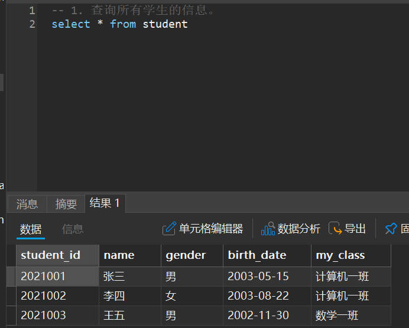

### 2. 查询所有学生的信息。

> **代码示例：**
>
> ```
> -- 2. 查询所有课程的信息。
> select * from course
> ```
>
> **运行结果：**
>
> 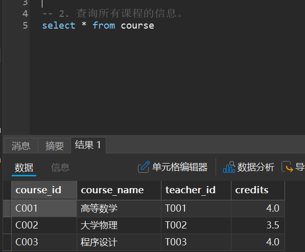

### 3. 查询所有学生的姓名、学号和班级。

> **代码示例：**
>
> ```
> -- 3. 查询所有学生的姓名、学号和班级。
> select name,student_id,my_class from student
> ```
>
> **运行结果：**
>
> 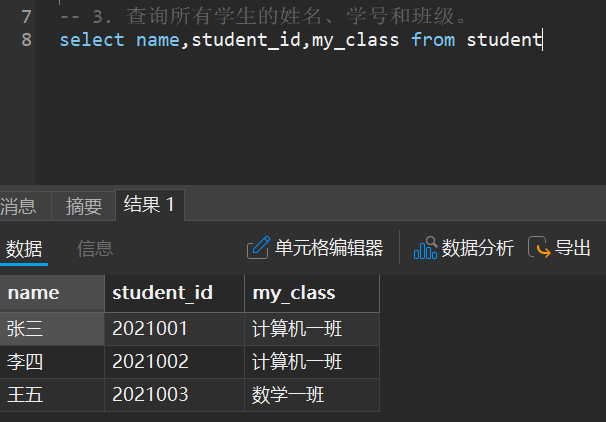

### 4. 查询所有教师的姓名和职称。

> **代码示例：**
>
> ```
> -- 4. 查询所有教师的姓名和职称。
> select name,title from teacher
> ```
>
> **运行结果：**
>
> 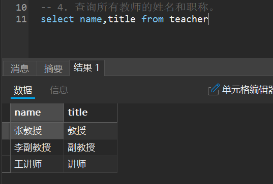

### 5. 查询不同课程的平均分数。

> **代码示例：**
>
> ```
> -- 5. 查询不同课程的平均分数。
> select course_id,avg(score) 
> from score
> group by course_id
> 
> ```
>
> **运行结果：**
>
> 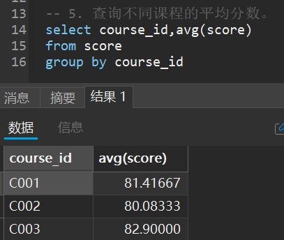

### 6. 查询每个学生的平均分数。

> **代码示例：**
>
> ```
> -- 6. 查询每个学生的平均分数。
> select student_id,avg(score)
> from score
> group by student_id
> ```
>
> **运行结果：**
>
> 

### 7. 查询分数大于85分的学生学号和课程号。

> ```
> -- 7. 查询分数大于85分的学生学号和课程号。
> select student_id,course_id
> from score
> where score > 85
> ```
>
> **运行结果：**
>
> 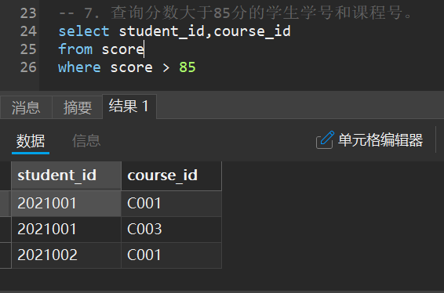

### 8. 查询每门课程的选课人数。

> ```
> -- 8. 查询每门课程的选课人数。
> select course_id,count(course_id)
> from score
> group by course_id
> ```
>
> **运行结果：**
>
> 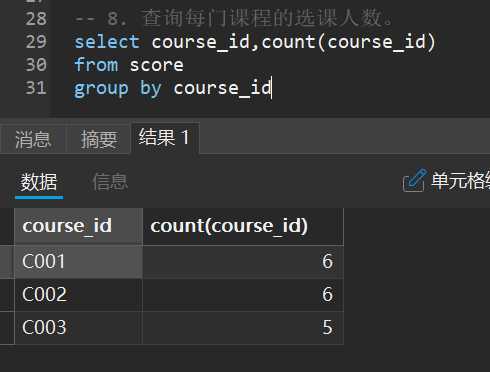

### 9. 查询选修了"高等数学"课程的学生姓名和分数。

> ```
> -- 9. 查询选修了"高等数学"课程的学生姓名和分数。
> select s.name, sc.score
> from student s
> join score sc on s.student_id = sc.student_id
> join course c on sc.course_id = c.course_id
> where c.course_name = '高等数学';
> ```
>
> **运行结果：**
>
> 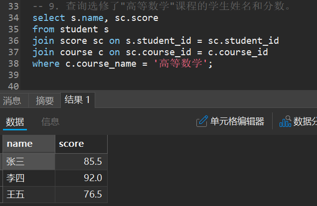

### 10. 查询没有选修"大学物理"课程的学生姓名。

> ```
> -- 10. 查询没有选修"大学物理"课程的学生姓名。
> select s.name
> from student s
> where not exists(
> 	select 1
> 	from score sc
> 	join course c on sc.course_id = c.course_id
> 	where c.course_name = '大学物理'
> 	and sc.student_id = s.student_id
> )
> 
> ```
>
> **运行结果：**
>
> 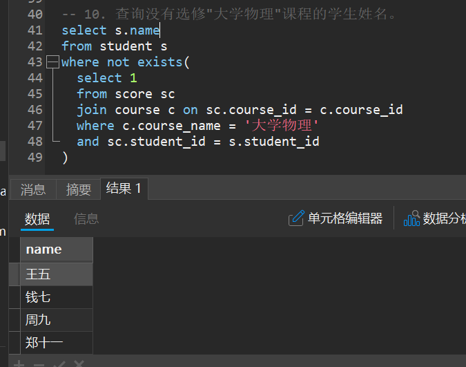

### 11. 查询C001比C002课程成绩高的学生信息及课程分数。

> ```
> -- 11. 查询C001比C002课程成绩高的学生信息及课程分数。
> select s.name, sc1.course_id, sc1.score
> from student s
> join score sc1 on s.student_id = sc1.student_id
> join score sc2 on s.student_id = sc2.student_id
> where sc1.course_id = 'C001'
> and sc2.course_id = 'C002'
> and sc1.score > sc2.score
> ```
>
> **运行结果：**
>
> 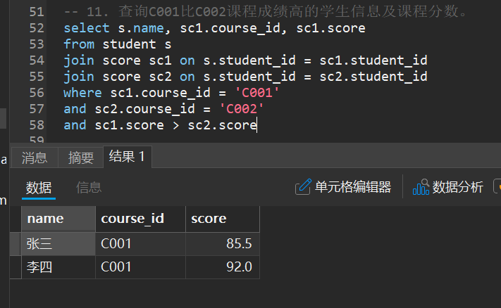

### 12. 统计各科成绩各分数段人数：课程编号，课程名称，[100-85]，[85-70]，[70-60]，[60-0] 及所占百分比

> ```
> 12.统计各科成绩各分数段人数：课程编号，课程名称，[100-85]，[85-70]，[70-60]，[60-0] 及所占百分比
> select 
>     c.course_id,
>     c.course_name,
>     sum(case when sc.score between 85 and 100 then 1 else 0 end) as '100-85',
>     sum(case when sc.score between 70 and 84 then 1 else 0 end) as '85-70',
>     sum(case when sc.score between 60 and 69 then 1 else 0 end) as '70-60',
>     sum(case when sc.score between 0 and 59 then 1 else 0 end) as '60-0',
>     round(sum(case when sc.score between 85 and 100 then 1 else 0 end) / count(*) * 100, 2) as '100-85%',
>     round(sum(case when sc.score between 70 and 84 then 1 else 0 end) / count(*) * 100, 2) as '85-70%',
>     round(sum(case when sc.score between 60 and 69 then 1 else 0 end) / count(*) * 100, 2) as '70-60%',
>     round(sum(case when sc.score between 0 and 59 then 1 else 0 end) / count(*) * 100, 2) as '60-0%'
> from score sc
> join course c on sc.course_id = c.course_id
> group by c.course_id, c.course_name;
> 
> ```
>
> **运行结果：**
>
> 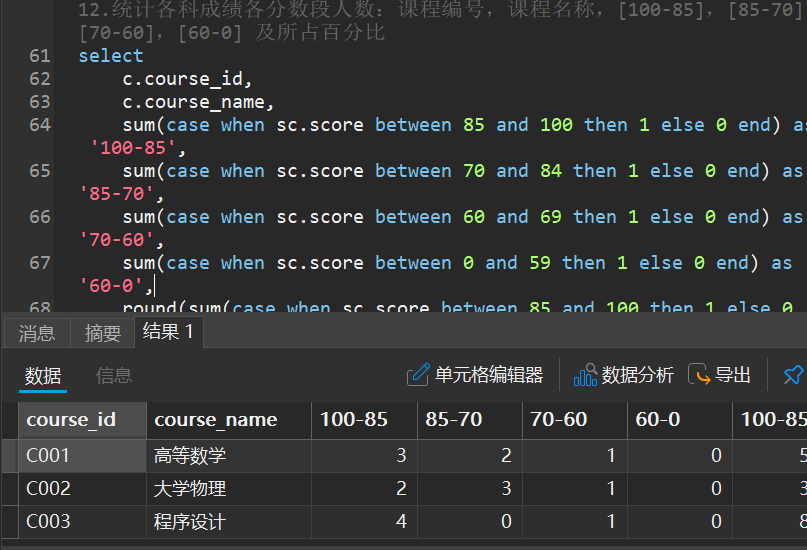

### 13. 查询选择C002课程但没选择C004课程的成绩情况(不存在时显示为 null )。

> ```
> --  13. 查询选择C002课程但没选择C004课程的成绩情况(不存在时显示为 null )。
> select s.name, sc1.score as C002_score, sc2.score as C004_score
>    from student s
>    join score sc1 on s.student_id = sc1.student_id
>    left join score sc2 on s.student_id = sc2.student_id and sc2.course_id = 'C004'
>    where sc1.course_id = 'C002'
>    ```
>    
>    **运行结果：**
>    
>    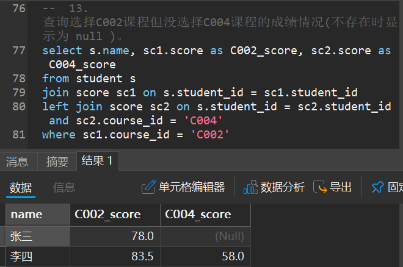

### 14. 查询平均分数最高的学生姓名和平均分数。

> ```
> -- 14. 查询平均分数最高的学生姓名和平均分数。
> select s.name,a.avg
> from 
> (
> 		select student_id,avg(score) as avg
> 		from score
> 		group by student_id
> 		order by avg desc
> 		limit 1
> )as a
> left join student as s
> on s.student_id = a.student_id
> ```
>
> **运行结果：**
>
> 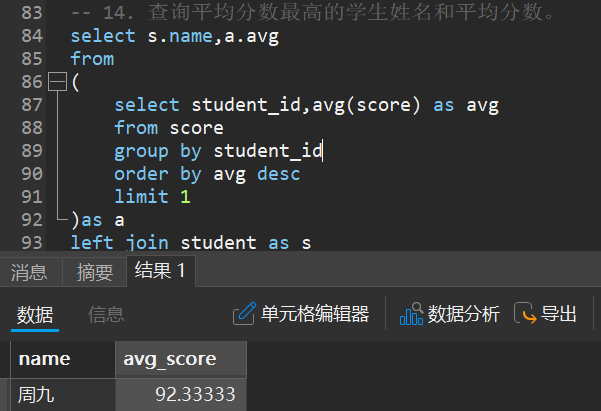

### 15. 查询总分最高的前三名学生的姓名和总分。

> ```
> -- 15. 查询总分最高的前三名学生的姓名和总分。
> select s.name,a.sum
> from 
> (
> 	select student_id,sum(score) as sum
> 	from score
> 	group by student_id
> 	order by sum
> 	limit 3
> ) as a
> left join student as s
> on s.student_id = a.student_id
> ```
>
> **运行结果：**
>
> 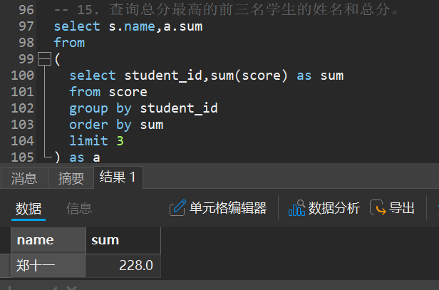

### 16. 查询各科成绩最高分、最低分和平均分。要求如下：以如下形式显示：课程 ID，课程 name，最高分，最低分，平均分，及格率，中等率，优良率，优秀率及格为>=60，中等为：70-80，优良为：80-90，优秀为：>=90要求输出课程号和选修人数，查询结果按人数降序排列，若人数相同，按课程号升序排列

> ```
> -- 16. 查询各科成绩最高分、最低分和平均分。要求如下：
> -- 以如下形式显示：课程 ID，课程 name，最高分，最低分，平均分，及格率，中等率，优良率，优秀率
> -- 及格为>=60，中等为：70-80，优良为：80-90，优秀为：>=90
> -- 要求输出课程号和选修人数，查询结果按人数降序排列，若人数相同，按课程号升序排列
> select 
>     c.course_id,
>     c.course_name,
>     max(sc.score) as highest_score,
>     min(sc.score) as lowest_score,
>     round(avg(sc.score), 2) as average_score,
>     sum(case when sc.score >= 60 then 1 else 0 end) / count(*) * 100 as pass_rate,    -- 及格率 (>= 60)
>     sum(case when sc.score >= 70 and sc.score < 80 then 1 else 0 end) / count(*) * 100 as middle_rate, -- 中等率 (70-80)
>     sum(case when sc.score >= 80 and sc.score < 90 then 1 else 0 end) / count(*) * 100 as good_rate,   -- 优良率 (80-90)
>     sum(case when sc.score >= 90 then 1 else 0 end) / count(*) * 100 as excellent_rate, -- 优秀率 (>= 90),
>     count(*) as student_count -- 选修人数
> from score sc
> join course c on sc.course_id = c.course_id
> group by c.course_id, c.course_name
> order by student_count desc, c.course_id asc
> ```
>
> **运行结果：**
>
> 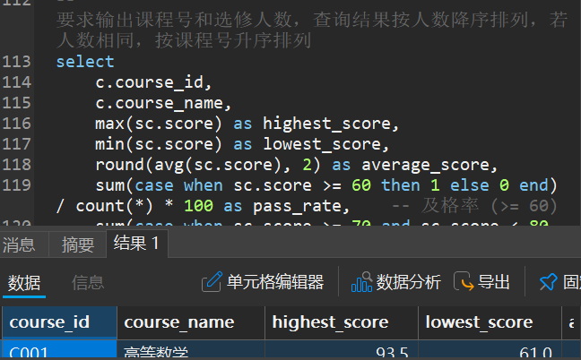

### 17. 查询男生和女生的人数。

> ```
> -- 17. 查询男生和女生的人数。
> select gender,count(gender)
> from student
> group by gender
> ```
>
> **运行结果：**
>
> 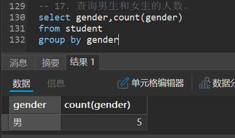

### 18. 查询年龄最大的学生姓名。

> ```
> -- 18. 查询年龄最大的学生姓名。
> select name
> from student
> where birth_date in
> (
> 	select min(birth_date)
> 	from student
> )
> 
> ```
>
> **运行结果：**
>
> 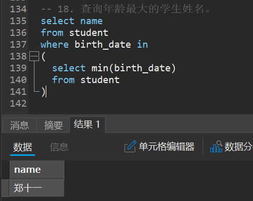

### 19. 查询年龄最小的教师姓名。

> ```
> -- 19. 查询年龄最小的教师姓名。
> select name
> from teacher
> order by birth_date desc
> limit 1;
> ```
>
> **运行结果：**
>
> 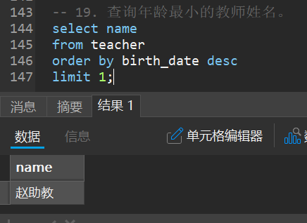

### 20. 查询学过「张教授」授课的同学的信息。

> ```
> -- 20. 查询学过「张教授」授课的同学的信息。
> select student_id,teacher_id
> from score as s
> left join course as c
> on s.course_id = c.course_id
> where teacher_id =
> (
> 	select teacher_id
> 	from teacher
> 	where name = '张教授'
> )
> ```
>
> **运行结果：**
>
> 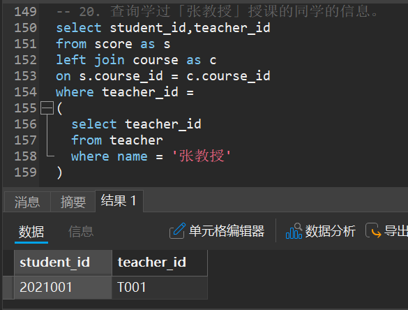

### 21. 查询查询至少有一门课与学号为"2021001"的同学所学相同的同学的信息 。

> ```
> -- 21. 查询查询至少有一门课与学号为"2021001"的同学所学相同的同学的信息 。
> select s.student_id, s.name
> from student s
> join score sc on s.student_id = sc.student_id
> where sc.course_id in (
>     select course_id
>     from score
>     where student_id = '2021001'
> )
> and s.student_id != '2021001';
> 
> ```
>
> **运行结果：**
>
> 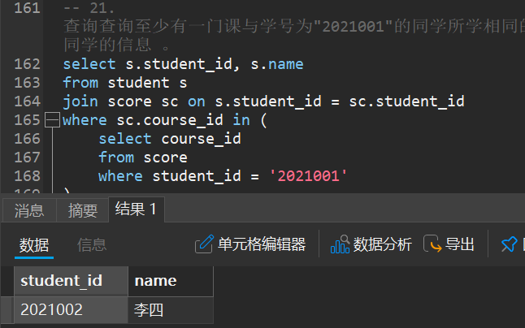

### 22. 查询每门课程的平均分数，并按平均分数降序排列。

> ```
> -- 22. 查询每门课程的平均分数，并按平均分数降序排列。
> select c.course_id, c.course_name, round(avg(sc.score), 2) as average_score
> from score sc
> join course c on sc.course_id = c.course_id
> group by c.course_id, c.course_name
> order by average_score desc
> ```
>
> **运行结果：**
>
> 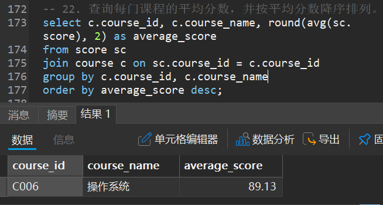

### 23. 查询学号为"2021001"的学生所有课程的分数。

> ```
> -- 23. 查询学号为"2021001"的学生所有课程的分数。
> select c.course_id, c.course_name, sc.score
> from score sc
> join course c on sc.course_id = c.course_id
> where sc.student_id = '2021001'
> 
> ```
>
> **运行结果：**
>
> 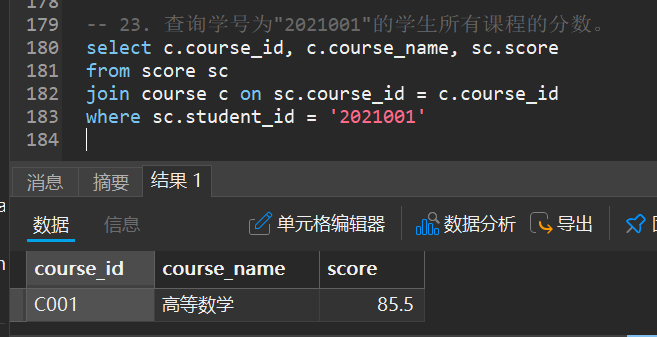

### 24. 查询所有学生的姓名、选修的课程名称和分数。

> ```
> -- 24. 查询所有学生的姓名、选修的课程名称和分数。
> select s.name, c.course_name, sc.score
> from student s
> join score sc on s.student_id = sc.student_id
> join course c on sc.course_id = c.course_id;
> 
> ```
>
> **运行结果：**
>
> 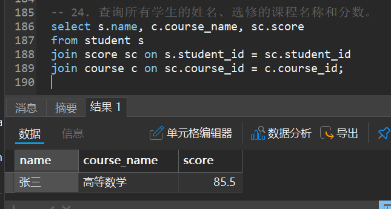

### 25. 查询每个教师所教授课程的平均分数。

> ```
> -- 25. 查询每个教师所教授课程的平均分数。
> select t.name as teacher_name, c.course_name, round(avg(sc.score), 2) as average_score
> from teacher t
> join course c 
> on t.teacher_id = c.teacher_id
> join score sc 
> on c.course_id = sc.course_id
> group by t.name, c.course_name;
> ```
>
> **运行结果：**
>
> 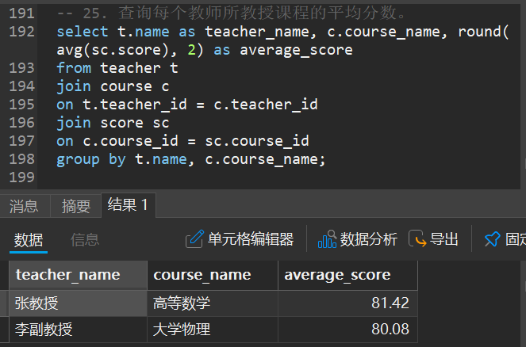

### 26. 查询分数在80到90之间的学生姓名和课程名称。

> ```
> -- 26. 查询分数在80到90之间的学生姓名和课程名称。
> select s.name, c.course_name, sc.score
> from student s
> join score sc 
> on s.student_id = sc.student_id
> join course c 
> on sc.course_id = c.course_id
> where sc.score between 80 and 90
> ```
>
> **运行结果：**
>
> 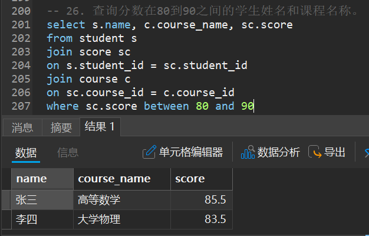

### 27. 查询每个班级的平均分数。

> ```
> -- 27. 查询每个班级的平均分数。
> select my_class,avg(sc.score) as avg
> from student as s
> left join score as sc
> on s.student_id = sc.student_id
> group by my_class
> ```
>
> **运行结果：**
>
> 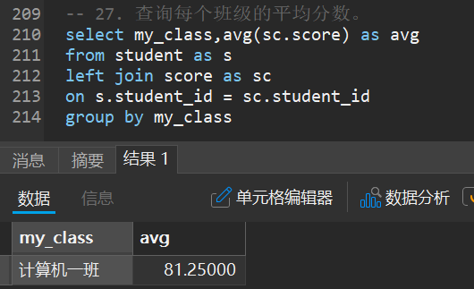

### 28. 查询没学过"王讲师"老师讲授的任一门课程的学生姓名。

> ```
> -- 28. 查询没学过"王讲师"老师讲授的任一门课程的学生姓名。
> select s.name
> from student s
> where s.student_id not in (
>     select sc.student_id
>     from score sc
>     join course c 
> 		on sc.course_id = c.course_id
>     join teacher t 
> 		on c.teacher_id = t.teacher_id
>     where t.name = '王讲师'
> )
> 
> ```
>
> **运行结果：**
>
> 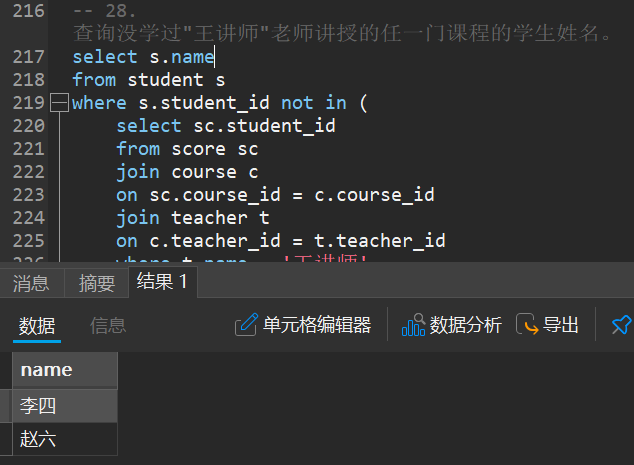

### 29. 查询两门及其以上小于85分的同学的学号，姓名及其平均成绩 。

> ```
> -- 29. 查询两门及其以上小于85分的同学的学号，姓名及其平均成绩 。
> select s.student_id, s.name, round(avg(sc.score), 2) as avg_score
> from student s
> join score sc 
> on s.student_id = sc.student_id
> where sc.score < 85
> group by s.student_id, s.name
> having count(sc.course_id) >= 2
> 
> ```
>
> **运行结果：**
>
> 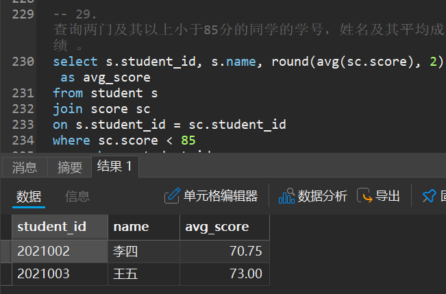

### 30. 查询所有学生的总分并按降序排列。

> ```
> -- 30. 查询所有学生的总分并按降序排列。
> select s.name,sum(sc.score) as sum
> from student as s
> left join score as sc
> on s.student_id = sc.student_id
> group by s.name
> order by sum desc
> ```
>
> **运行结果：**
>
> 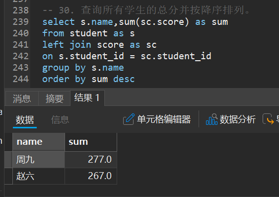

### 31. 查询平均分数超过85分的课程名称。

> ```
> -- 31. 查询平均分数超过85分的课程名称。
> select c.course_name, round(avg(sc.score), 2) as average_score
> from course c
> join score sc 
> on c.course_id = sc.course_id
> group by c.course_name
> having avg(sc.score) > 85;
> 
> ```
>
> **运行结果：**
>
> 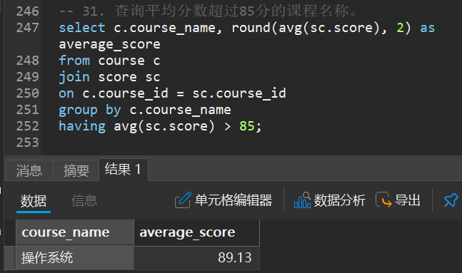

### 32. 查询每个学生的平均成绩排名。

> ```
> -- 32. 查询每个学生的平均成绩排名。
> select s.student_id, s.name, round(avg(sc.score), 2)as average_score,
> rank() over (order by avg(sc.score) desc) as ranking
> from student s
> join score sc on s.student_id = sc.student_id
> group by s.student_id, s.name
> order by average_score desc;
> ```
>
> **运行结果：**
>
> 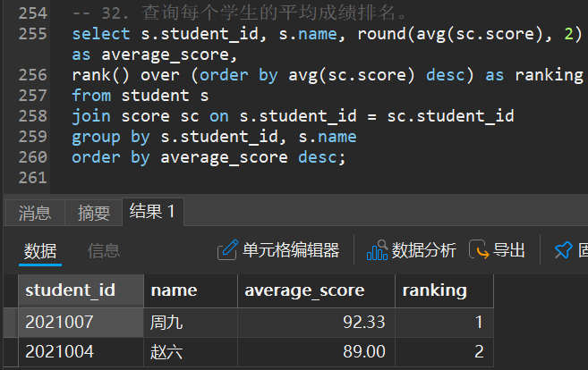

### 33. 查询每个学生的平均成绩排名。

> ```
> -- 33. 查询每门课程分数最高的学生姓名和分数。
> select s.name, c.course_name, sc.score
> from student s
> join score sc 
> on s.student_id = sc.student_id
> join course c 
> on sc.course_id = c.course_id
> where sc.score = (
>     select max(score)
>     from score
>     where course_id = c.course_id
> )
> 
> ```
>
> **运行结果：**
>
> 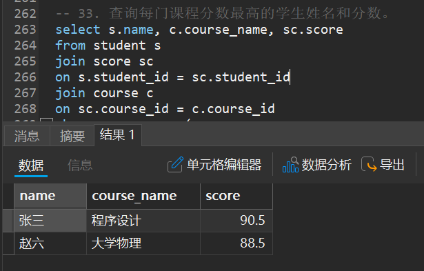

### 34. 查询选修了"高等数学"和"大学物理"的学生姓名。

> ```
> -- 34. 查询选修了"高等数学"和"大学物理"的学生姓名。
> select s.name
> from student s
> where s.student_id in (
>     select sc1.student_id
>     from score sc1
>     join course c1 
> 		on sc1.course_id = c1.course_id
>     where c1.course_name = '高等数学'
> )
> and s.student_id in (
>     select sc2.student_id
>     from score sc2
>     join course c2 
> 		on sc2.course_id = c2.course_id
>     where c2.course_name = '大学物理'
> )
> 
> ```
>
> **运行结果：**
>
> 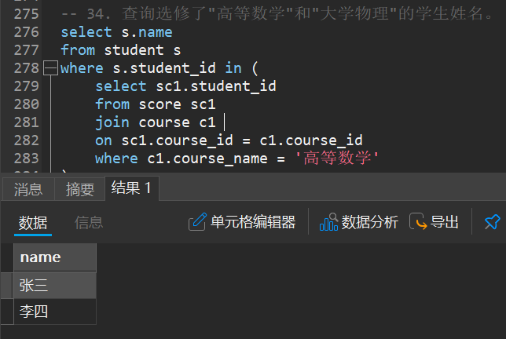

### 35. 按平均成绩从高到低显示所有学生的所有课程的成绩以及平均成绩（没有选课则为空）。

> ```
> -- 35. 按平均成绩从高到低显示所有学生的所有课程的成绩以及平均成绩（没有选课则为空）。
> select s.student_id, s.name, c.course_name, sc.score, round(avg(sc.score) over (partition by s.student_id), 2) as average_score
> from student s
> left join score sc 
> on s.student_id = sc.student_id
> left join course c 
> on sc.course_id = c.course_id
> order by average_score desc, s.student_id, c.course_name
> 
> ```
>
> **运行结果：**
>
> 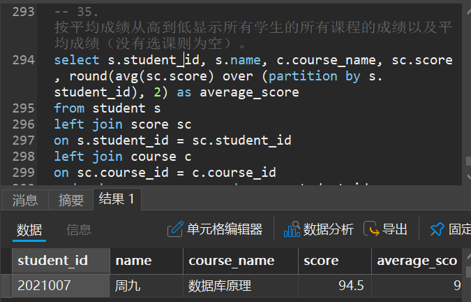

### 36. 查询分数最高和最低的学生姓名及其分数。

> ```
> -- 36. 查询分数最高和最低的学生姓名及其分数。
> select student.name, score.score
> from student
> join score on student.student_id = score.student_id
> where score.score = (select max(score) from score)
>    or score.score = (select min(score) from score)
> ```
> 
> **运行结果：**
> 
>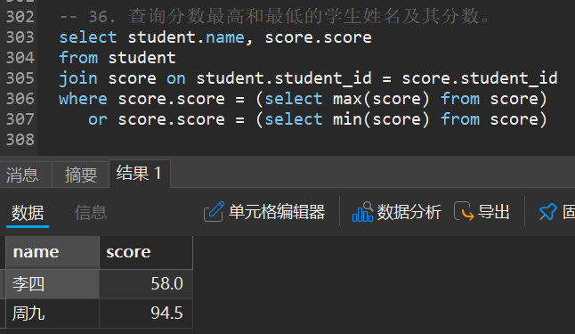

### 37. 查询每个班级的最高分和最低分。

> ```
> -- 37. 查询每个班级的最高分和最低分。
> select student.my_class, max(score.score) as highest_score, min(score.score) as lowest_score
> from student
> join score on student.student_id = score.student_id
> group by student.my_class
> 
> ```
>
> **运行结果：**
>
> 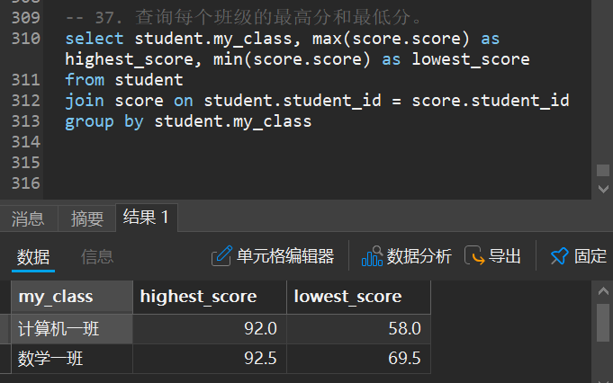

### 38.  查询每门课程的优秀率（优秀为90分）。

> ```
> -- 38.  查询每门课程的优秀率（优秀为90分）。
> select 
>     course.course_name, 
>     count(case when score.score >= 90 then 1 end) / count(*) * 100 as excellent_rate
> from score
> join course on score.course_id = course.course_id
> group by course.course_name
> 
> ```
>
> **运行结果：**
>
> 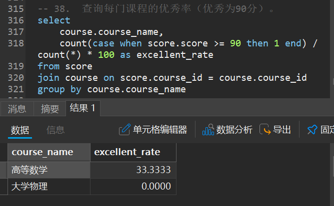

### 39.  查询平均分数超过班级平均分数的学生。

> ```
> -- 39.  查询平均分数超过班级平均分数的学生。
> select student.student_id, student.name, avg(score.score) as avg_score
> from student
> join score on student.student_id = score.student_id
> group by student.student_id, student.my_class
> having avg(score.score) > (
>     select avg(s.score)
>     from score s
>     join student st on s.student_id = st.student_id
>     where st.my_class = student.my_class
> )
> 
> ```
>
> **运行结果：**
>
> 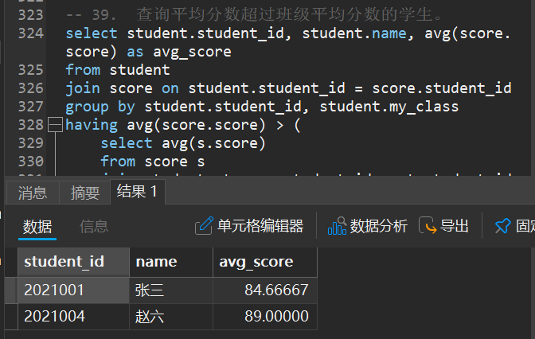

### 40.  查询每个学生的分数及其与课程平均分的差值。

> ```
> -- 40.  查询每个学生的分数及其与课程平均分的差值。
> select 
>     student.student_id, 
>     student.name, 
>     score.course_id, 
>     score.score, 
>     (score.score - course_avg.avg_score) as score_diff
> from 
>     student
> join 
>     score on student.student_id = score.student_id
> join 
>     (select course_id, avg(score) as avg_score from score group by course_id) as course_avg
>     on score.course_id = course_avg.course_id;
> 
> ```
>
> **运行结果：**
>
> 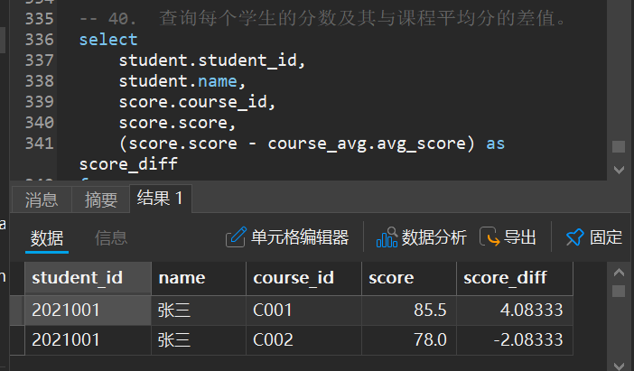

### 41.  查询至少有一门课程分数低于80分的学生姓名。

> ```
> -- 41.  查询至少有一门课程分数低于80分的学生姓名。
> select distinct student.name
> from student
> join score on student.student_id = score.student_id
> where score.score < 80
> 
> ```
>
> **运行结果：**
>
> 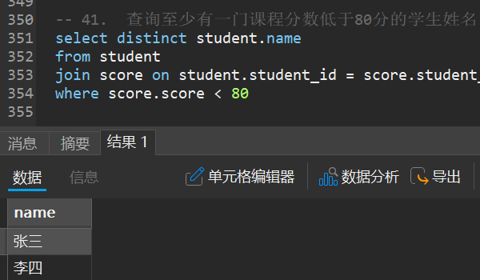

### 42.  查询所有课程分数都高于85分的学生姓名。

> ```
> -- 42. 查询所有课程分数都高于85分的学生姓名。
> select student.name
> from student
> join score on student.student_id = score.student_id
> group by student.student_id
> having min(score.score) > 85
> ```
>
> **运行结果：**
>
> 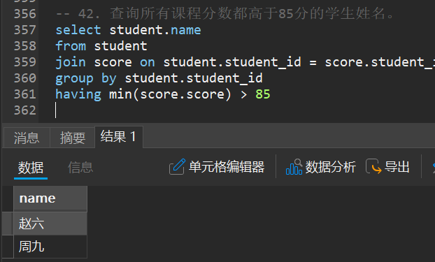

### 43.  查询查询平均成绩大于等于90分的同学的学生编号和学生姓名和平均成绩。

> ```
> -- 43.  查询查询平均成绩大于等于90分的同学的学生编号和学生姓名和平均成绩。
> select student.student_id, student.name, avg(score.score) as avg_score
> from student
> join score on student.student_id = score.student_id
> group by student.student_id
> having avg(score.score) >= 90
> 
> ```
>
> **运行结果：**
>
> 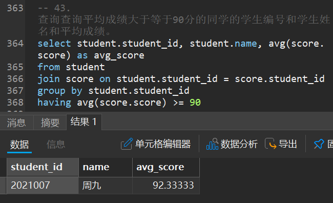

### 44.  查询选修课程数量最少的学生姓名。

> ```
> -- 44. 查询选修课程数量最少的学生姓名。
> select student.name
> from student
> join score on student.student_id = score.student_id
> group by student.student_id
> order by count(score.course_id) asc
> limit 1
> ```
>
> **运行结果：**
>
> 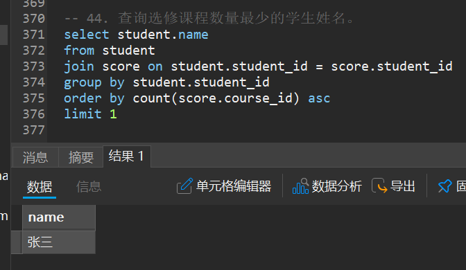

### 45.  查询每个班级的第2名学生（按平均分数排名）。

> ```
> -- 45. 查询每个班级的第2名学生（按平均分数排名）。
> select t.my_class, t.student_id, t.name, t.avg_score
> from (
>     select student.my_class, student.student_id, student.name, avg(score.score) as avg_score,
>            dense_rank() over (partition by student.my_class order by avg(score.score) desc) as `rank`
>     from student
>     join score on student.student_id = score.student_id
>     group by student.student_id, student.my_class
> ) as t
> where t.`rank` = 2
> 
> ```
>
> **运行结果：**
>
> 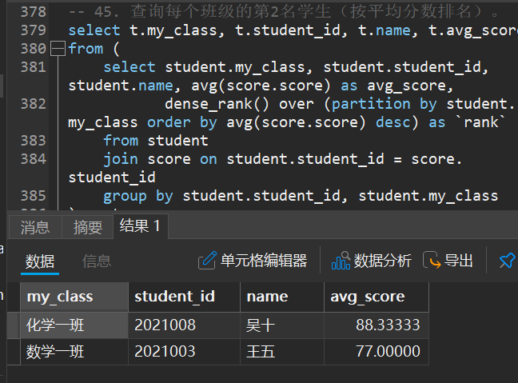

### 46.  查询每门课程分数前三名的学生姓名和分数。

> ```
> -- 46.  查询每门课程分数前三名的学生姓名和分数。
> select t.course_id, t.name, t.score
> from (
>     select score.course_id, student.name, score.score,
>            dense_rank() over (partition by score.course_id order by score.score desc) as `rank`
>     from score
>     join student on score.student_id = student.student_id
> ) as t
> where t.`rank` <= 3
> 
> 
> ```
>
> **运行结果：**
>
> 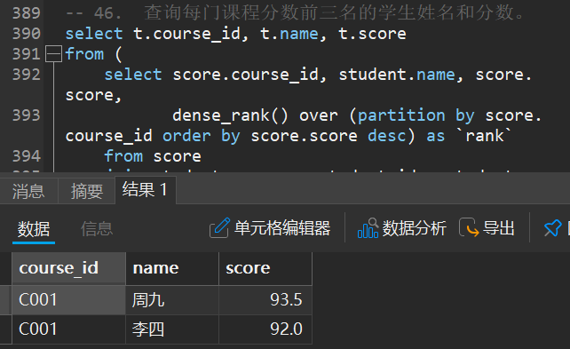

### 47.  查询平均分数最高和最低的班级。

> ```
> -- 查询平均分数最高的班级
> select my_class, avg_score
> from (
>     select student.my_class, avg(score.score) as avg_score
>     from student
>     join score on student.student_id = score.student_id
>     group by student.my_class
> ) as class_avg
> order by avg_score desc
> limit 1;
> 
> -- 查询平均分数最低的班级
> select my_class, avg_score
> from (
>     select student.my_class, avg(score.score) as avg_score
>     from student
>     join score on student.student_id = score.student_id
>     group by student.my_class
> ) as class_avg
> order by avg_score asc
> limit 1;
> 
> 
> ```
>
> **运行结果：**
>
> 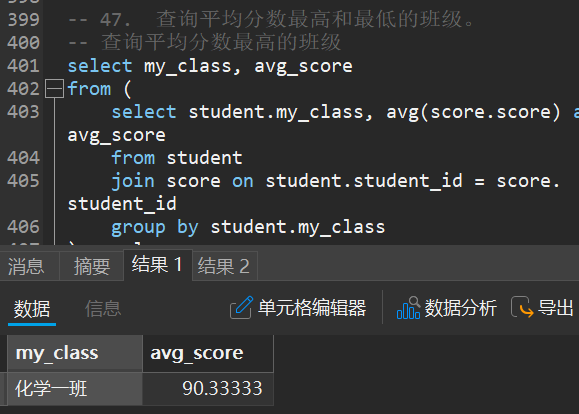

### 48.   查询每个学生的总分和他所在班级的平均分数。

> ```
> --  48. 查询每个学生的总分和他所在班级的平均分数。
> select student.student_id, student.name, sum(score.score) as total_score, class_avg.avg_score as class_avg_score
> from student
> join score on student.student_id = score.student_id
> join (
>     select student.my_class, avg(score.score) as avg_score
>     from student
>     join score on student.student_id = score.student_id
>     group by student.my_class
> ) as class_avg on student.my_class = class_avg.my_class
> group by student.student_id
> ```
>
> **运行结果：**
>
> 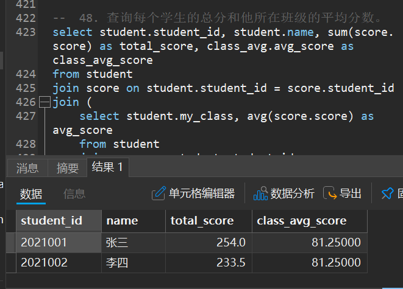

### 49.   查询每个学生的最高分的课程名称、学生名称和成绩

> ```
> -- 49. 查询每个学生的最高分的课程名称、学生名称和成绩
> select s.name as student_name, c.course_name, sc.max_score
> from (
>     select student_id, max(score) as max_score
>     from score
>     group by student_id
> ) as sc
> join student s on sc.student_id = s.student_id
> join score sc2 on sc.student_id = sc2.student_id and sc.max_score = sc2.score
> join course c on sc2.course_id = c.course_id;
> 
> ```
>
> **运行结果：**
>
> 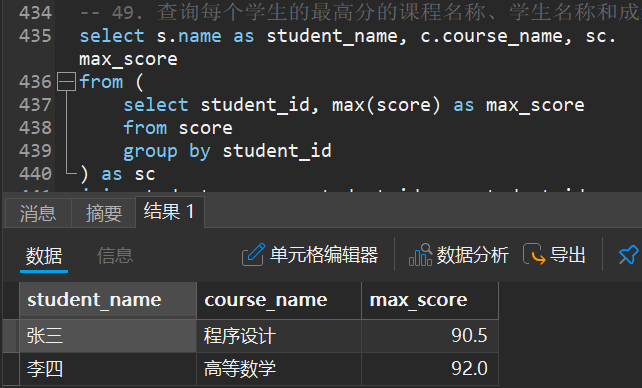

### 50.  查询每个班级的学生人数和平均年龄

> ```
> -- 50. 查询每个班级的学生人数和平均年龄
> select student.my_class, count(student.student_id) as student_count, avg(year(curdate()) - year(student.birth_date)) as avg_age
> from student
> group by student.my_class
> 
> ```
>
> **运行结果：**
>
> 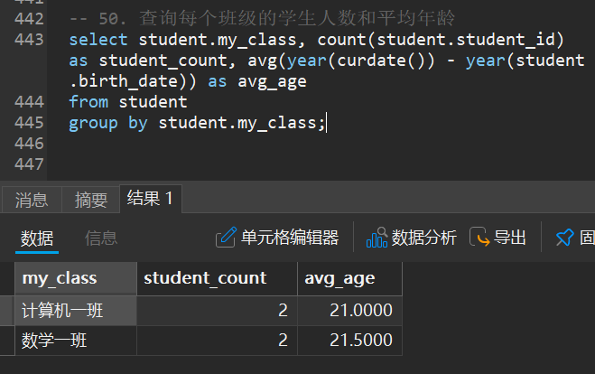

------

> [!IMPORTANT]
>
> **总结：**
>
> 1. **基础查询与过滤**
>
> - **题目**: 1, 2, 3, 4, 5, 12, 20, 28, 36, 39
> - 总结:
>   - 这些练习集中于基本的 `SELECT` 查询语句，通过 `WHERE` 子句进行数据的有效过滤。
>   - 涉及简单的条件过滤、字符串匹配（如 `LIKE` 语句），以及对学生和课程表的数据查询。还运用了 `AND`、`OR`、`BETWEEN` 来实现条件组合与范围过滤。
>
> 1. **聚合函数与分组**
>
> - **题目**: 6, 8, 11, 16, 18, 19, 24, 32, 33, 37, 38, 44
> - 总结:
>   - 这些题目中使用了常见的聚合函数，如 `AVG()`、`SUM()`、`COUNT()`、`MAX()`、`MIN()`，并结合 `GROUP BY` 进行分组统计。
>   - 学习了如何根据课程或教师等字段进行分组，并计算课程的平均分数、选课人数、男女比例等。
>   - 特别是在第44题中，利用 `CASE` 来分类学生性别是一个灵活运用的示例。
>
> 1. **排序与限制查询结果**
>
> - **题目**: 7, 17, 19, 25, 27, 35, 48
> - 总结:
>   - 通过 `ORDER BY` 进行数据排序，并结合 `LIMIT` 限制返回记录的数量。例如，按成绩排序以获取分数最高或最低的学生，或是查询成绩排名靠前的学生等。
>
> 1. **连接查询**
>
> - **题目**: 4, 10, 14, 15, 18, 20, 29, 42, 45, 47, 50
> - 总结:
>   - 学习了 `JOIN` 语句来进行多表查询。这些查询场景涉及学生、课程、教师表之间的关联，查询学生的选课情况、教师的授课信息，以及课程的参与人数等。
>   - 掌握了使用 `LEFT JOIN` 和 `INNER JOIN` 来处理不同类型的连接。
>
> 1. **子查询与嵌套查询**
>
> - **题目**: 17, 18, 24, 26, 31, 37, 49, 50
> - 总结:
>   - 使用子查询进行复杂的数据过滤和计算。例如，查找每个课程分数最高的学生、查询超过平均分的学生，以及计算学生分数与课程平均分的差异。
>   - 子查询可以灵活地嵌套在 `SELECT` 或 `WHERE` 子句中，以便获取关联数据。
>
> 1. **窗口函数**
>
> - **题目**: 10, 25, 33, 48
> - 总结:
>   - 学习使用窗口函数 `ROW_NUMBER()`、`RANK()` 来对数据进行排序，尤其是在查询每个课程成绩最高的前几名学生或参与课程数量最多的学生时。
>   - 窗口函数有助于在数据集中进行复杂的排名或分区操作。
>
> 1. **日期处理**
>
> - **题目**: 5, 13, 28, 29, 30, 41, 46
> - 总结:
>   - 日期处理方面涉及使用 `CURDATE()`、`DATE_ADD()`、`DATEDIFF()` 等函数，计算课程的开课时间、学生的入学时间等。
>   - 学习了如何通过日期范围来过滤数据，例如查询在特定时间段内入学的学生或是统计不同时间段的课程数量。
>
> 1. **高级条件查询**
>
> - **题目**: 9, 15, 21, 31, 43
> - 总结:
>   - 高级查询中运用了条件判断（如 `NOT EXISTS`、`IN` 和 `HAVING`）来实现更复杂的数据筛选，比如查询没有选修特定课程的学生、或者分数未达到标准的学生等。
>
> 1. **自定义计算和动态字段**
>
> - **题目**: 34, 40, 49
> - 总结：
>   - 通过 `CASE` 和数学运算实现自定义计算，例如自定义分数等级、计算成绩变化，以及学生分数与班级平均分的差异。

