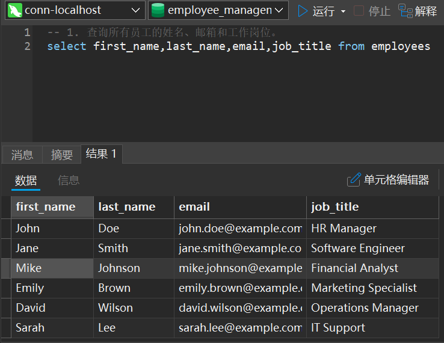
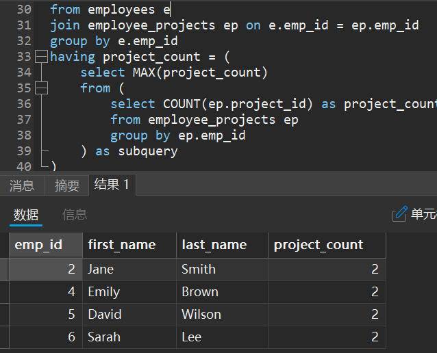
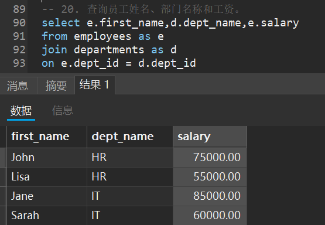

# SQL练习

> 作业探讨了**SQL查询技术**在数据库管理中的应用，重点实现了基于**多表关联和聚合函数**的复杂查询功能。内容包括如何使用**JOIN**来关联员工、部门和项目表，以及通过**聚合函数**（如 `SUM()`、`AVG()` 和 `COUNT()`）计算部门的**员工数量**、**工资总和**和**项目参与情况**。作业中详细说明了如何利用**子查询**和**窗口函数**来解决如**每个部门工资最高的员工**、**员工工资与部门平均工资的差值**等问题。此外，作业还实现了多个SQL查询来测试数据的准确性和性能表现，确保各类信息能够有效提取和呈现。查询结果采用清晰的格式显示，便于后续的数据分析和管理工作，增强了数据库的**可维护性和可扩展性**。通过此作业的实现，提升了对数据查询效率的理解，为后续数据库优化和业务逻辑的改进奠定了基础。

------

### 1. 查询所有员工的姓名、邮箱和工作岗位。

> **代码示例：**
>
> ```
> -- 1. 查询所有员工的姓名、邮箱和工作岗位。
> select first_name,last_name,email,job_title from employees
> ```
>
> **运行结果：**
>
> 

### 2. 查询所有部门的名称和位置。

> **代码示例：**
>
> ```
> -- 2. 查询所有部门的名称和位置
> select dept_name,location from departments
> ```
>
> **运行结果：**
>
> 

### 3. 查询工资超过70000的员工姓名和工资。

> **代码示例：**
>
> ```
> -- 3. 查询工资超过70000的员工姓名和工资
> select first_name,last_name,salary from employees where salary > 70000
> ```
>
> **运行结果：**
>
> 

### 4. 查询IT部门的所有员工。

> **代码示例：**
>
> ```
> -- 4. 查询IT部门的所有员工
> select first_name,last_name from employees where dept_id in (select dept_id from departments where dept_name = 'IT')
> ```
>
> **运行结果：**
>
> 

### 5. 查询入职日期在2020年之后的员工信息。

> **代码示例：**
>
> ```
> -- 5. 询入职日期在2020年之后的员工信息
> select * from employees where hire_date >= '2021-01-01'
> ```
>
> **运行结果：**
>
> 

### 6. 计算每个部门的平均工资。

> **代码示例：**
>
> ```
> -- 6. 计算每个部门的平均工资
> select avg(salary),dept_id from employees group by dept_id
> ```
>
> **运行结果：**
>
> 

### 7. 查询工资最高的前3名员工信息。

> **代码示例：**
>
> ```
> -- 7. 查询工资最高的前3名员工信息
> select * from employees order by salary desc limit 3
> ```
>
> **运行结果：**
>
> 

### 8. 查询每个部门员工数量。

> **代码示例：**
>
> ```
> -- 8. 查询每个部门员工数量。
> select dept_id,count(dept_id) from employees group by dept_id
> ```
>
> **运行结果：**
>
> 

### 9. 查询没有分配部门的员工。

> **代码示例：**
>
> ```
> -- 9. 查询没有分配部门的员工。
> select first_name,last_name from employees where dept_id is null
> ```
>
> **运行结果：**
>
> 

### 10. 查询参与项目数量最多的员工。

> **代码示例：**
>
> ```
> select e.emp_id, e.first_name, e.last_name, COUNT(ep.project_id) as project_count
> from employees e
> join employee_projects ep on e.emp_id = ep.emp_id
> group by e.emp_id
> having project_count = (
>     select MAX(project_count)
>     from (
>         select COUNT(ep.project_id) as project_count
>         from employee_projects ep
>         group by ep.emp_id
>     ) as subquery
> )
> order by e.emp_id;
> ```
>
> **运行结果：**
>
> 

### 11. 计算所有员工的工资总和。

> **代码示例：**
>
> ```
> -- 11. 计算所有员工的工资总和。
> select sum(salary) from employees
> ```
>
> **运行结果：**
>
> 

### 12. 查询姓"Smith"的员工信息。

> **代码示例：**
>
> ```
> -- 12. 查询姓"Smith"的员工信息。
> select * from employees where first_name = 'Smith'
> ```
>
> **运行结果：**
>
> 

### 13. 查询即将在半年内到期的项目。

> **代码示例：**
>
> ```
> -- 13. 查询即将在半年内到期的项目。
> select * from projects where end_date between curdate() and date_add(curdate(), interval 6 month);
> ```
>
> **运行结果：**
>
> 

### 14. 查询至少参与了两个项目的员工。

> **代码示例：**
>
> ```
> -- 14.查询至少参与了两个项目的员工。
> select e.emp_id,e.first_name,e.last_name,ep.count from employees as e join (select emp_id,count(emp_id) as count from employee_projects group by emp_id having count >= 2) as ep on e.emp_id = ep.emp_id
> ```
>
> **运行结果：**
>
> 

### 15. 查询没有参与任何项目的员工。

> **代码示例：**
>
> ```
> -- 15. 查询没有参与任何项目的员工。
> select *
> from employees as e
> where e.emp_id not in(
> 	select DISTINCT ep.emp_id
> 	from employee_projects as ep
> )
> ```
>
> **运行结果：**
>
> 

### 16. 计算每个项目参与的员工数量。

> **代码示例：**
>
> ```
> -- 16.计算每个项目参与的员工数量。
> select project_id,count(project_id) as count
> from employee_projects
> group by project_id
> ```
>
> **运行结果：**
>
> 

### 17. 查询工资第二高的员工信息。

> **代码示例：**
>
> ```
> -- 17. 查询工资第二高的员工信息。
> select * 
> from employees 
> order by salary DESC
> limit 1,1
> ```
>
> **运行结果：**
>
> 

### 18. 查询每个部门工资最高的员工。

> **代码示例：**
>
> ```
> -- 18. 查询每个部门工资最高的员工。
> select e.*
> from employees e
> join (
>     select dept_id, max(salary) as max_salary
>     from employees
>     group by dept_id
> ) as max_salaries on e.dept_id = max_salaries.dept_id and e.salary = max_salaries.max_salary;
> ```
>
> **运行结果：**
>
> 

### 19. 计算每个部门的工资总和,并按照工资总和降序排列。

> **代码示例：**
>
> ```
> -- 19. 计算每个部门的工资总和,并按照工资总和降序排列。
> select dept_id,sum(salary) as sum 
> from employees
> group by dept_id
> order by sum desc
> ```
>
> **运行结果：**
>
> 

### 20. 查询员工姓名、部门名称和工资。

> **代码示例：**
>
> ```
> -- 20. 查询员工姓名、部门名称和工资。
> select e.first_name,d.dept_name,e.salary
> from employees as e
> join departments as d
> on e.dept_id = d.dept_id
> ```
>
> **运行结果：**
>
> 

### 21. 查询每个员工的上级主管(假设emp_id小的是上级)。

> **代码示例：**
>
> ```
> -- 21. 查询每个员工的上级主管(假设emp_id小的是上级)。
> select e1.emp_id,e1.first_name as worker_first_name,e1.last_name as worker_last_name,e2.first_name as boss_first_name,e2.last_name as boss_last_nam
> from employees as e1
> join employees as e2
> on e1.dept_id = e2.dept_id
> where e1.emp_id > e2.emp_id
> ```
>
> **运行结果：**
>
> 

### 22. 查询所有员工的工作岗位,不要重复。

> **代码示例：**
>
> ```
> -- 22. 查询所有员工的工作岗位,不要重复。
> select distinct job_title
> from employees
> ```
>
> **运行结果：**
>
> 

### 23. 查询平均工资最高的部门。

> **代码示例：**
>
> ```
> -- 23. 查询平均工资最高的部门。
> select dept_id,avg(salary) as avg_salary
> from employees
> group by dept_id
> order by avg_salary DESC
> limit 1
> ```
>
> **运行结果：**
>
> 

### 24. 查询工资高于其所在部门平均工资的员工。

> **代码示例：**
>
> ```
> -- 24. 查询工资高于其所在部门平均工资的员工。
> select e.first_name,e.last_name
> from employees as e
> join (
> 	select dept_id,avg(salary) as avg_salary
> 	from employees
> 	group by dept_id) as avg
> on e.dept_id = avg.dept_id
> where e.salary > avg.avg_salary
> ```
>
> **运行结果：**
>
> 

### 25. 查询每个部门工资前两名的员工。

> **代码示例：**
>
> ```
> -- 25. 查询每个部门工资前两名的员工。
> select * 
> from (
> 	select dept_id,first_name,last_name,
> 	rank() over(
> 		partition by dept_id
> 		order by salary desc
> 	)as rn
> 	from employees
> ) as ranked
> where rn <= 2
> ```
>
> **运行结果：**
>
> 

------

# **窗口函数补充**

> **与聚合函数的区别：**
>
> 
>
> **分类：**
>
> 

### 序号函数

> **分类：row_number()、rank()、dense_rank()**
>
> **格式：**
>
> ```
> rownumber()||rank()||dense_rank() over(
> 	partition by ...（按照什么分组）
> 	order by ....（组内按照什么排序）
> )
> ```
>
> **举例：**
>
> ​	**row_number()：**
>
> 
>
> ​	**解释：**
>
> ​		**partition by dname：**按照dname字段进行分组
>
> ​		**order by salary desc：**组内按照salary降序
>
> ​		**row_number() over (......) as rn：**新增一行叫rn（组内会有排序）
>
> ​	
>
> ​	**rank()：**
>
> ​	
>
> ​	**解释：**
>
> ​		**rank()与row_number()的区别在：**salary相同时，排名保持一致，但会腾出第二名
>
> ​	
>
> ​	**dense_rank()：**
>
> ​	
>
> ​	**解释：**
>
> ​		**rank()与dense_rank()的区别在：**salary相同时，排名保持一致，不会腾出第二名

------

### 26. 查询跨部门的项目(参与员工来自不同部门)。

> **代码示例：**
>
> ```
> -- 26. 查询跨部门的项目(参与员工来自不同部门)。
> select p.project_id, p.project_name
> from projects p
> join employee_projects ep on p.project_id = ep.project_id
> join employees e on ep.emp_id = e.emp_id
> group by p.project_id, p.project_name
> having count(distinct e.dept_id) > 1;
> ```
>
> **运行结果：**
>
> 

### 27. 查询每个员工的工作年限,并按工作年限降序排序。

> **代码示例：**
>
> ```
> -- 27. 查询每个员工的工作年限,并按工作年限降序排序。
> select emp_id,first_name,last_name,hire_date
> from employees
> order by hire_date desc
> ```
>
> **运行结果：**
>
> 

### 28. 查询本月过生日的员工(假设hire_date是生日)。

> **代码示例：**
>
> ```
> -- 28. 查询本月过生日的员工(假设hire_date是生日)。
> select *
> from employees
> where month(hire_date) = month(curdate()) and year(hire_date) <> year(curdate());
> ```
>
> **运行结果：**
>
> 

### 30. 计算每个项目的持续时间(天数)。

> **代码示例：**
>
> ```
> -- 30. 计算每个项目的持续时间(天数)。
> select project_id, project_name, 
>        datediff(end_date, start_date) as duration_days
> from projects;
> 
> ```
>
> **运行结果：**
>
> 

### 31. 查询没有进行中项目的部门。

> **代码示例：**
>
> ```
> -- 31. 查询没有进行中项目的部门。
> select d.dept_id, d.dept_name
> from departments d
> where d.dept_id not in (
>     select distinct e.dept_id
>     from employees e
>     join employee_projects ep on e.emp_id = ep.emp_id
>     join projects p on ep.project_id = p.project_id
>     where p.start_date <= curdate() and p.end_date >= curdate()
> );
> 
> ```
>
> **运行结果：**
>
> 

### 32. 查询员工数量最多的部门。

> **代码示例：**
>
> ```
> -- 32. 查询员工数量最多的部门。
> select d.dept_id, d.dept_name, count(e.emp_id) as employee_count
> from departments d
> left join employees e on d.dept_id = e.dept_id
> group by d.dept_id, d.dept_name
> order by employee_count desc
> limit 1;
> ```
>
> **运行结果：**
>
> 

### 33. 查询参与项目最多的部门。

> **代码示例：**
>
> ```
> -- 33. 查询参与项目最多的部门。
> select b.dept_id, count(distinct b.project_id) as count
> from (
> 	select e.emp_id, e.dept_id, ep.project_id
> 	from employees as e
> 	join employee_projects as ep on e.emp_id = ep.emp_id
> ) as b
> group by b.dept_id
> order by count desc
> limit 1;
> ```
>
> **运行结果：**
>
> 

### 34. 计算每个员工的薪资涨幅(假设每年涨5%)。

> **代码示例：**
>
> ```
> -- 34. 计算每个员工的薪资涨幅(假设每年涨5%)
> select 
>     emp_id, 
>     first_name, 
>     last_name, 
>     salary, 
>     hire_date,
>     round(salary * power(1.05, year(curdate()) - year(hire_date)), 2) as adjusted_salary,
>     round((salary * power(1.05, year(curdate()) - year(hire_date)) - salary), 2) as salary_increase
> from employees;
> ```
>
> **运行结果：**
>
> 

### 35. 查询入职时间最长的3名员工。

> **代码示例：**
>
> ```
> -- 35. 查询入职时间最长的3名员工。
> select emp_id,first_name,last_name, (CURRENT_DATE - hire_date) as times 
>    from employees 
>    order by times desc
>    limit 3
>    ```
>    
>    **运行结果：**
>    
> 

### 36. 询名字和姓氏相同的员工。

> **代码示例：**
>
> ```
> -- 36. 查询名字和姓氏相同的员工。
> select first_name,last_name
> from employees
> where first_name = last_name
> ```
>
> **运行结果：**
>
> 

### 37. 查询每个部门薪资最低的员工。

> **代码示例：**
>
> ```
> -- 37. 查询每个部门薪资最低的员工。
> select e.*
> from employees e
> join (
>     select dept_id, min(salary) as min_salary
>     from employees
>     group by dept_id
> ) as min_salaries on e.dept_id = min_salaries.dept_id and e.salary = min_salaries.min_salary;
> ```
>
> **运行结果：**
>
> 

### 38. 查询哪些部门的平均工资高于公司的平均工资。

> **代码示例：**
>
> ```
> -- 38. 查询哪些部门的平均工资高于公司的平均工资。
> select dept_id,avg(salary) as avg
> from
> employees
> group by dept_id
> having avg > 
> (
> 	select avg(salary)
> 	from employees
> 	)
> ```
>
> **运行结果：**
>
> 

### 39. 查询姓名包含"son"的员工信息。

> **代码示例：**
>
> ```
> -- 39. 查询姓名包含"son"的员工信息。
> select *
> from employees
> where (first_name like '%son%') or (last_name like '%son%')
> ```
>
> **运行结果：**
>
> 

### 40. 查询所有员工的工资级别(可以自定义工资级别)。

> **代码示例：**
>
> ```
> -- 40. 查询所有员工的工资级别(可以自定义工资级别)。
> select emp_id, first_name, last_name, salary,
>        case
>            when salary < 50000 then '低级'
>            when salary between 50000 and 70000 then '中级'
>            when salary between 70001 and 90000 then '高级'
>            else '顶级'
>        end as salary_level
> from employees;
> ```
>
> **运行结果：**
>
> 

### 41. 查询每个项目的完成进度(根据当前日期和项目的开始及结束日期)。

> **代码示例：**
>
> ```
> -- 41. 查询每个项目的完成进度(根据当前日期和项目的开始及结束日期)。
> select project_id, project_name, start_date, end_date,
>        case
>            when curdate() < start_date then '未开始'
>            when curdate() > end_date then '已完成'
>            else concat(round(100 * (datediff(curdate(), start_date) / datediff(end_date, start_date)), 2), '% 完成')
>        end as progress
> from projects;
> 
> ```
>
> **运行结果：**
>
> 

### 42. 查询每个经理(假设job_title包含'Manager'的都是经理)管理的员工数量。

> **代码示例：**
>
> ```
> 42.查询每个经理(假设job_title包含'Manager'的都是经理)管理的员工数量。
> select m.emp_id as manager_id, m.first_name as manager_first_name, m.last_name as manager_last_name, count(e.emp_id) as employee_count
> from employees m
> join employees e on m.emp_id < e.emp_id and m.dept_id = e.dept_id
> where m.job_title like '%manager%'
> group by m.emp_id, m.first_name, m.last_name;
> ```
>
> **运行结果：**
>
> 

### 43. 查询工作岗位名称里包含"Manager"但不在管理岗位(salary<70000)的员工。

> ```
> -- 43.查询工作岗位名称里包含"Manager"但不在管理岗位(salary<70000)的员工。
> select emp_id,first_name,last_name
> from employees
> where job_title like '%manager%' and salary < 70000
> ```
>
> **运行结果：**
>
> 

### 44. 计算每个部门的男女比例(假设以名字首字母A-M为女性,N-Z为男性)。

> ```
> -- 44.计算每个部门的男女比例(假设以名字首字母A-M为女性,N-Z为男性)。
> select d.dept_id, d.dept_name,
>        sum(case when left(e.first_name, 1) between 'A' and 'M' then 1 else 0 end) as female_count,
>        sum(case when left(e.first_name, 1) between 'N' and 'Z' then 1 else 0 end) as male_count,
>        round(sum(case when left(e.first_name, 1) between 'A' and 'M' then 1 else 0 end) / 
>              sum(case when left(e.first_name, 1) between 'N' and 'Z' then 1 else 0 end), 2) as gender_ratio
> from departments d
> join employees e on d.dept_id = e.dept_id
> group by d.dept_id, d.dept_name;
> 
> ```
>
> **运行结果：**
>
> 

### 45. 查询每个部门年龄最大和最小的员工(假设hire_date反应了年龄)。

> ```
> -- 45.查询每个部门年龄最大和最小的员工(假设hire_date反应了年龄)。
> select d.dept_id, d.dept_name, '最大年龄员工' as employee_type, e.emp_id, e.first_name, e.last_name, e.hire_date
> from employees e
> join departments d on e.dept_id = d.dept_id
> where e.hire_date = (
>     select min(e2.hire_date) 
>     from employees e2
>     where e2.dept_id = e.dept_id
> )
> union all
> select d.dept_id, d.dept_name, '最小年龄员工' as employee_type, e.emp_id, e.first_name, e.last_name, e.hire_date
> from employees e
> join departments d on e.dept_id = d.dept_id
> where e.hire_date = (
>     select max(e2.hire_date) 
>     from employees e2
>     where e2.dept_id = e.dept_id
> )
> 
> ```
>
> **运行结果：**
>
> 

### 46. 查询连续3天都有员工入职的日期。

> ```
> -- 46. 查询连续3天都有员工入职的日期。
> select distinct e1.hire_date
> from employees e1
> join employees e2 on date_add(e1.hire_date, interval 1 day) = e2.hire_date
> join employees e3 on date_add(e1.hire_date, interval 2 day) = e3.hire_date
> order by e1.hire_date;
> ```
>
> **运行结果：**
>
> 

### 47. 查询员工姓名和他参与的项目数量。

> ```
> -- 47. 查询员工姓名和他参与的项目数量。
> select e.first_name, e.last_name, count(ep.project_id) as project_count
> from employees e
> left join employee_projects ep on e.emp_id = ep.emp_id
> group by e.emp_id, e.first_name, e.last_name;
> ```
>
> **运行结果：**
>
> 

### 48. 查询每个部门工资最高的3名员工。

> ```
> -- 48. 查询每个部门工资最高的3名员工。
> select *
> from (
>     select e.emp_id, e.first_name, e.last_name, e.salary, e.dept_id, d.dept_name,
>            row_number() over (partition by e.dept_id order by e.salary desc) as `rank`
>     from employees e
>     join departments d on e.dept_id = d.dept_id
> ) as ranked_employees
> where ranked_employees.`rank` <= 3;
> 
> ```
>
> **运行结果：**
>
> 

### 49. 计算每个员工的工资与其所在部门平均工资的差值。

> ```
> -- 49. 计算每个员工的工资与其所在部门平均工资的差值。
> select e.emp_id, e.first_name, e.last_name, e.salary, d.dept_name,
>        e.salary - (
>            select avg(e2.salary)
>            from employees e2
>            where e2.dept_id = e.dept_id
>        ) as salary_diff
> from employees e
> join departments d on e.dept_id = d.dept_id;
> ```
>
> **运行结果：**
>
> 

### 50. 查询所有项目的信息,包括项目名称、负责人姓名(假设工资最高的为负责人)、开始日期和结束日期。

> ```
> -- 50.查询所有项目的信息,包括项目名称、负责人姓名(假设工资最高的为负责人)、开始日期和结束日期。
> select p.project_name, e.first_name, e.last_name, p.start_date, p.end_date
> from projects p
> join employee_projects ep on p.project_id = ep.project_id
> join employees e on ep.emp_id = e.emp_id
> where e.salary = (
>     select max(e2.salary)
>     from employees e2
>     join employee_projects ep2 on e2.emp_id = ep2.emp_id
>     where ep2.project_id = p.project_id
> );
> 
> ```
>
> **运行结果：**
>
> 

------

> [!IMPORTANT]
>
> **总结：**
>
> 1. **基础查询与过滤**
>
> - **题目**: 1, 2, 3, 4, 5, 12, 20, 28, 36, 39
> - **总结:**
>   - 这些练习侧重于基础的 `SELECT` 查询语句，通过 `WHERE` 子句进行数据过滤。
>   - 涉及简单的条件过滤、字符串匹配（例如 `LIKE` 语句），以及对员工和部门表的数据查询。还使用了 `AND`、`OR`、`BETWEEN` 进行条件组合和日期范围过滤。
>
> 2. **聚合函数与分组**
>
> - **题目**: 6, 8, 11, 16, 18, 19, 24, 32, 33, 37, 38, 44
> - **总结:**
>   - 这些题目中，使用了常见的聚合函数，如 `AVG()`、`SUM()`、`COUNT()`、`MAX()`、`MIN()`，并结合 `GROUP BY` 进行分组统计。
>   - 学习了如何根据部门或项目等字段进行分组，并计算部门员工数量、工资总和、男女比例等。
>   - 特别是在第44题中，结合 `CASE` 来区分性别是一个灵活运用的例子。
>
> 3. **排序与限制查询结果**
>
> - **题目**: 7, 17, 19, 25, 27, 35, 48
> - **总结:**
>   - 通过 `ORDER BY` 进行排序，并结合 `LIMIT` 限制返回的记录数量。例如，按工资排序，获取工资最高或最低的员工，或是查询入职时间最长的员工等。
>
> 4. **连接查询**
>
> - **题目**: 4, 10, 14, 15, 18, 20, 29, 42, 45, 47, 50
> - **总结:**
>   - 学习了 `JOIN` 语句来进行多表查询。这些查询场景涉及员工、部门、项目表之间的关联，查询员工参与的项目、部门信息、以及经理管理的员工数量等。
>   - 学会了使用 `LEFT JOIN` 和 `INNER JOIN` 来处理不同类型的连接场景。
>
> 5. **子查询与嵌套查询**
>
> - **题目**: 17, 18, 24, 26, 31, 37, 49, 50
> - **总结:**
>   - 使用子查询进行更复杂的数据过滤和计算。例如，查找每个部门工资最高或最低的员工、工资超过部门平均值的员工、以及计算工资与部门平均工资的差值。
>   - 子查询可以嵌套在 `SELECT` 或 `WHERE` 子句中，灵活获取关联数据。
>
> 6. **窗口函数**
>
> - **题目**: 10, 25, 33, 48
> - **总结:**
>   - 学习使用窗口函数 `ROW_NUMBER()`、`RANK()` 来对数据进行分组排序，尤其是在查询每个部门工资最高的前几名员工或参与项目最多的部门时。
>   - 窗口函数可以帮助数据集中进行复杂的排名或分区操作。
>
> 7. **日期处理**
>
> - **题目**: 5, 13, 28, 29, 30, 41, 46
> - **总结:**
>   - 日期处理方面涉及使用 `CURDATE()`、`DATE_ADD()`、`DATEDIFF()` 等函数，计算项目的持续时间、员工入职时间、以及即将到期的项目。
>   - 学习了如何通过日期范围过滤数据，例如查询入职日期在某个时间段内的员工，或是连续多天有员工入职的情况。
>
> 8. **高级条件查询**
>
> - **题目**: 9, 15, 21, 31, 43
> - **总结:**
>   - 高级查询中使用了条件判断（如 `NOT EXISTS`、`IN` 和 `HAVING`）来实现更复杂的数据筛选，比如查询没有分配部门的员工、没有进行中的项目、或者不在管理岗位的员工等。
>
> 9. **自定义计算和动态字段**
>
> - **题目**: 34, 40, 49
> - **总结：**
>   - 通过 `CASE` 和数学运算实现自定义计算，比如自定义工资级别、计算薪资涨幅，以及员工与部门平均工资的差值。

