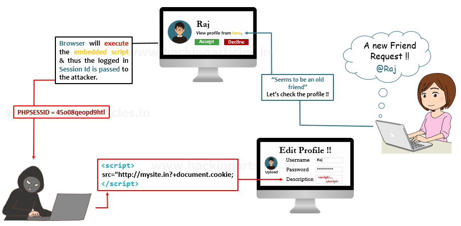

# 会话技术扩展内容

> 探讨了**JavaWeb**应用中的**会话管理技术**，涵盖了**会话安全性**、**分布式会话管理**和**会话状态的序列化与反序列化**。内容包括对**会话劫持**、**XSS**、**CSRF**等安全问题的防御措施，分布式环境下的**会话同步**及**Session集群**方案，利用**Redis**实现分布式会话管理，以及**Java对象序列化**与**自定义序列化策略**的应用。

------

## 一、会话安全性

> 了解**会话安全性**的原因与意义在于，Web应用的会话管理是保障用户身份验证和授权流程安全的关键环节，直接关系到用户数据的安全性和系统的稳定性。掌握会话安全性能够帮助开发者有效应对诸如**会话劫持**、**XSS**和**CSRF**等常见安全威胁，确保会话数据在传输和存储过程中不被攻击者窃取或篡改，从而提高应用的整体安全性，满足合规性要求并增强用户信任。

### 1. 会话劫持和防御

> 攻击者通过窃取用户的**会话标识（Session ID）**，冒充合法用户进行操作的攻击方式。在Web应用中，用户的会话状态通常通过会话标识来维护，该标识通常存储在**Cookie**或**URL**中，一旦攻击者获得该标识，便可以伪装成该用户与服务器进行交互，获取其权限或敏感数据。

|          会话劫持方式          |                             原理                             |                           防御措施                           |
| :----------------------------: | :----------------------------------------------------------: | :----------------------------------------------------------: |
|        中间人攻击(MITM)        | 攻击者通过监听**未加密的网络连接**，直接截取用户的会话标识。 | 使用**HTTPS加密**所有通信，确保会话数据在传输过程中无法被窃取。 |
|       跨站脚本攻击(XSS)        | 攻击者通过**恶意脚本**窃取用户浏览器中的会话标识，伪装成该用户。 | 实施严格的**输入验证**和**输出编码**，防止不受信任的脚本执行，同时启用**HTTPOnly标志**，防止客户端脚本访问会话Cookie。 |
|       跨站请求伪造(CSRF)       | 攻击者**诱骗用户**发送带有用户会话标识的请求，**伪装成用户**执行操作。 |     使用**CSRF Token验证机制**，确保请求由用户自身发起。     |
| 会话固定攻击(Session Fixation) | 、攻击者通过给用户**分配特定会话标识**，使用户登录后仍保持该标识，进而利用该标识冒充用户。 | 在用户登录后**强制生成新的Session ID**，确保每次会话的唯一性和安全性。 |
|      恶意软件或浏览器插件      | 攻击者通过用户设备上的**恶意程序**获取会话标识，伪装成用户。 | 鼓励用户**安装安全软件**并保持浏览器和插件的安全性，同时启用**双重身份验证**等附加安全措施。 |


### 2. 跨站脚本攻击(XSS)和防御

> **定义：**XSS(Cross-Site Scripting,跨站脚本攻击)是一种**代码注入攻击**。攻击者在目标网站上**注入恶意代码**，当用户(被攻击者)登录网站时就会执行这些恶意代码，通过这些脚本可以读取**cookie,session tokens**，或者网站其他敏感的网站信息，对用户进行钓鱼欺诈。
>
> 
>
> **工作原理：**
>
> 1. **攻击者发现存在漏洞的网站，然后利用漏洞在网页中注入恶意脚本。**
>
>    凡是对用户输入限制不够严格的网站都可能发生脚本注入。恶意脚本通常是JavaScript，当然也可以是Java、VBScriptActiveX、Flash等。
>
> 2. **当用户访问网站时，恶意脚本被加载到浏览器中并触发执行。**
>
>    触发恶意脚本执行的方法有很多种，例如，引诱用户点击链接，或当网页加载或用户鼠标停留在网页的特定元素上时自动触发脚本
>    执行。
>
> 3. **恶意脚本访问浏览器留存的Cookie、会话令牌以及其他敏感信息，甚至可以改写页面内容，从而达成攻击目的。**
>
>    攻击者通过窃取的用户Cookie就可以冒充用户，执行用户能够执行的操作，窃取用户身份信息、泄露用户文件等。另外攻击者还可以利用跨站脚本传播恶意软件、破坏网页内容、进行网络钓鱼等，实施更具破坏性的攻击。
>
> **工作原理图：**
>
> 
>
> **常见跨站脚本攻击类型：**
>
> 1. **反射型跨站脚本攻击**
>
>    **定义：**反射型跨站脚本攻击是**最常见和最简单**的攻击形式。所谓反射，是指此种类型的注入脚本必须被包含在发往Web服务器的请求中，然后Web服务器以某种方式反射到用户浏览器执行。也就是注入脚本作为客户端的请求提交给Web服务器，服务器解析后在响应消息中返回脚本由浏览器执行。
>
>    **示例：**
>
>    ​	**第一步：**首先，我们提供了一个**用户提交页面**的表单。用户可以在这个页面中输入数据，并通过表单将数据提交到后端进行处理。后端负责接收用户提交的数据，并将其响应回前端页面。这种页面通常用于数据交互，但如果**缺乏适当的输入验证和输出编码**，可能会引发跨站脚本（XSS）攻击。
>
>    
>
>    ​	**第二步：**为了测试是否存在反射型XSS漏洞，我们在页面的输入框中提交了一段恶意脚本代码：
>
>    ```
>    <script>alert('hack')</script>
>    ```
>
>    该脚本利用了页面未对输入数据进行过滤的漏洞，通过表单提交该代码并查看其在页面中的响应。理论上，安全的系统应该对输入内容进行过滤或转义，以防止脚本执行。
>
>    
>
>    ​	**第三步**：提交后，页面立即弹出了带有**“hack”信息的弹窗**，这说明页面直接**执行了我们插入的恶意脚本**。正如预期，由于页面未对用户输入进行适当的处理，攻击者可以通过输入恶意脚本代码，并通过服务器响应返回给用户，导致脚本在客户端执行。这种情况非常典型地反映了反射型XSS的工作原理。
>
>    
>
>    **总结**：
>    	这种攻击方式被称为**反射型XSS**，其核心特点是用户提交的数据被服务器直接反射回前端，并在客户端执行未经过滤的代码。数据流向可以总结为：**前端 → 后端 → 前端**。攻击者通过输入恶意代码，绕过后端处理，再次返回给客户端，使得脚本在浏览器中执行，导致攻击成功。
>
>    
>
> 2. **存储型跨站脚本攻击**
>
>    **定义：**存储型跨站脚本攻击也称为持久型跨站脚本攻击，是一种**最具破坏性的跨站脚本攻击**。注入的脚本**永久存储**在Web服务器上，如数据库、内存或文件系统中。只要注入脚本代码没有被清理，每次用户访问网页时都将加载恶意脚本。存储型跨站脚本攻击一般发生在**论坛、博客、留言板**等允许用户共享内容的网站，如果网站存在漏洞，未严格校验用户输入内容就可能被攻击者利用。攻击者利用发帖、评论、修改个人信息等功能提交恶意脚本代码到Web服务器进行保存，那么只要访问对应网页的用户都会在不知情的情况下读取恶意脚本。
>
>    **示例：**
>
>    ​	**第一步：**用户在页面上通过**表单提交数据**。提交的数据会被传递给后端，后端接收这些数据并将其**存储在数据库**中。当其他用户访问另一个页面时，后端从数据库中调出这些数据并返回给前端。如果用户提交的数据中包含恶意的 XSS 代码，这些代码会在页面加载时执行。
>
>    
>
>    ​	**第二步：**我们提交的具体数据为：
>
>    ```
>    - ID：`1`
>    - Name：`<script>alert('hack')</script>`
>    ```
>    
>    ​	需要注意的是，提交的 `hack` 字符串中的单引号必须进行转义。因为在 SQL 语句中，`$name` 是用单引号括起来的，所以如果不转义，输入中的单引号会意外闭合 SQL 语句中的单引号，从而导致注入失败。提交后，我们可以查看数据库中的存储情况。
>    
>    
>    
>    ​	**第三步**：通过**查询数据库**，我们可以看到，恶意的 XSS 代码已经成功插入数据库中。当其他用户访问 `showXSS.jsp` 页面时，这段 XSS 代码被读取并在页面中执行。
>    
>    
>    
>    
>    
>    **总结**：
>    	这存储型 XSS 攻击的数据流向如下：**前端** → **后端** → **数据库** → **后端** → **前端**。这种攻击模式使得恶意脚本可以通过数据库在其他用户的浏览器中执行，导致安全隐患。
>    
>    
>
> 3. **基于DOM的跨站脚本攻击**
>
>    **定义：**基于DOM（Document Object Model，文档对象模型）的跨站脚本攻击是一种**更高级的攻击形式**，通过**篡改DOM**注入恶意脚本。DOM提供对文档结构化的描述，并将HTML页面与脚本、程序语言联系起来，当网页被加载时，浏览器会创建页面的文档对象模型DOM。Web程序的客户端侧**JavaScript脚本**可以对DOM进行编辑从而动态修改网页内容，也就是从DOM获取数据然后在用户本地执行。
>    
>    **示例：**
>    
>    ​	**第一步：**在用户提交页面中，用户可以输入数据并通过表单提交。提交的数据经过后端处理后，将用于动态生成页面内容。
>    
>    
>    
>    ​	**第二步：**用户可以在输入框中插入以下内容：
>    
>    ```
>    
>    ```
>    
>    
>    
>    ​	**第三步**：提交后，页面将自动触发一个警告框，显示 `hack` 的内容。这表明用户插入的 JavaScript 代码已被浏览器执行。
>    
>    
>    
>    **总结**：
>    	上述过程展示了 **DOM 型 XSS 漏洞** 的典型特征。在此攻击中，数据的流向为：**前端** → **浏览器**。此漏洞的存在使得攻击者能够通过操控用户输入，直接在浏览器中执行恶意脚本，从而引发安全隐患。
>

|    XSS类型     | 防御方法                                                     |
| :------------: | :----------------------------------------------------------- |
| **存储型 XSS** | **1. 验证与过滤**：严格验证用户输入，过滤恶意字符和标签。 <br />**2. 转义**：对用户输入进行 HTML 实体转义。 <br />**3. 安全 Cookie**：使用 HttpOnly 属性保护 Cookie。 <br />**4. 内容安全策略 (CSP)**：限制可加载和执行的资源。 <br />**5. 渗透测试**：定期进行安全审计与渗透测试。 |
| **反射型 XSS** | **1. 验证与过滤**：确保用户输入经过验证和过滤。 <br />**2. 转义**：展示用户输入前进行适当转义。  <br />**3. 安全 Cookie**：设置 HttpOnly 属性保护 Cookie。  <br />**4. 实施 CSP**：限制 JavaScript 的来源。 |
| **DOM 型 XSS** | **1. 验证与过滤**：全面验证用户输入，特别是 JavaScript 相关内容。<br />**2. 转义**：动态生成 HTML 时进行转义。 <br />**3. CSP**：限制可执行脚本的来源。 <br />**4. 渗透测试**：定期进行安全测试和代码审计。 |


### 3. 跨站请求伪造(CSRF)和防御

> **定义：**跨站请求伪造（Cross-site request forgery），CSRF是指利用受害者尚未失效的身份认证信息（登录状态中的Cookie等），诱骗受害者点击恶意链接，或者访问包含攻击代码的页面，**在受害者不知情的情况下以受害者的身份向服务器发送请求**，从而完成非法操作。
>
> **攻击过程**：
>
> 1. **用户登录**： 用户打开浏览器，访问受信任的网站 A，并输入用户名和密码进行登录。经过验证后，网站 A 生成相应的 cookie 信息，并将其返回给浏览器，用户成功登录网站 A。
> 2. **访问其他网站**： 在未退出网站 A 的情况下，用户在同一浏览器中打开一个新的页面，访问攻击者控制的网站 B。
> 3. **恶意代码执行**： 网站 B 返回包含恶意代码的内容。这些代码可能构造了对网站 A 的请求，意图利用用户的身份进行未授权操作。
> 4. **请求发送**： 浏览器在接收到来自网站 B 的恶意代码后，会在用户不知情的情况下，携带用户在网站 A 的 cookie 信息，向网站 A 发起请求。
> 5. **服务器响应**： 网站 A 在接收到请求时，并未意识到该请求是由网站 B 发起的。基于用户的 cookie 信息，网站 A 将根据用户的权限处理该请求，最终导致恶意代码的执行或数据的修改。
>
> **CSRF 攻击的产生条件：**
>
> 1. **用户登录状态**：用户必须已经成功登录网站 A，并在浏览器中保持有效的 cookie 信息。
> 2. **访问恶意网站**：用户在未退出网站 A 的情况下，访问攻击者提供的诱导网站 B，攻击者通常通过构造访问网站 A 的 URL 来实施攻击。
> 3. **恶意请求构造**：攻击者需要精心构造对网站 A 的请求数据包，以利用用户的权限进行未授权的操作。
> 4. **缺乏 CSRF 防护**：网站 A 在处理请求时未采取任何防范措施，以防止 CSRF 攻击。
>
> **CSRF 攻击的特性：**
>
> - CSRF 攻击利用了用户的身份验证机制，通过伪造请求以欺骗服务器，使其相信请求是来自于受害者的浏览器。攻击者无法直接获取或查看用户的 cookie 信息。
> - 攻击者的目的通常不是窃取数据，而是发送请求以执行未授权的操作，从而直接修改服务器上的数据。
>
> **常见跨站请求伪造类型：**
>
> 1. **GET 类型**：此类攻击通过诱导用户访问构造的 GET 请求 URL 来实施。用户在不知情的情况下，点击链接或访问某个网页，从而发送恶意请求。
>
>    例如：
>
>    ```
>    正常转账 URL： http://bank/transfer?amount=10000&for=bob
>    伪造的转账 URL： http://bank/transfer?amount=10000&for=hacker
>    ```
>
>    在此示例中，攻击者利用有效的转账 URL 模式，构造一个恶意请求，试图将资金转移至攻击者的账户。
>
> 2. **POST 类型**：此类攻击通过诱导用户访问包含自动提交的隐藏表单的恶意网站。用户只需打开该页面，便会自动发起不知情的转账请求。
>
>    ```
>    <form action="http://bank/transfer" method="POST">
>        <input type="hidden" name="account" value="user" />
>        <input type="hidden" name="amount" value="10000" />
>        <input type="hidden" name="for" value="hacker" />
>    </form>
>    <script> document.forms[0].submit(); </script> 
>    ```
>
>    在这个示例中，攻击者利用用户对恶意网站的信任，触发了一个未授权的银行转账请求。
>
> 3. **其他攻击方式**：
>
>    - **伪造链接**：在受害者网站的评论区或论坛中插入一个锚标签（`<a>`），当用户点击该链接时，将无意中发起一个伪造请求。
>
>      ```
>      <a href="http://bank/transfer?amount=10000&for=hacker" target="_blank">点击此处</a>
>      ```
>
>    - **伪装图片**：在受害者网站的评论区中发布一个伪装成图片的链接，实际内容为恶意请求。用户在查看图片时，无意中执行了攻击者构造的请求。
>
>      ```
>      
>      ```

| CSRF类型  | 防御方法                                                     |
| :-------- | ------------------------------------------------------------ |
| GET 类型  | **验证 HTTP Referer**：检查请求中的 Referer 字段，确保请求来自同一源。 **Token 验证**：在请求中添加不可伪造的 token，并在服务器端验证。 |
| POST 类型 | **Token 验证**：在请求中包含随机生成的 token，并在服务器端验证。 **用户验证**：在关键操作中使用验证码以确认用户的真实意图。 |
| 其他类型  | **自定义 HTTP 头**：在请求中添加自定义头部，并在服务器端验证。 **内容安全策略（CSP）**：通过 CSP 限制可执行内容的来源，防止恶意请求的执行。 |


------

## 二、分布式会话管理

> 了解 **分布式会话管理** 的原因与意义在于，现代 Web 应用程序的会话管理是实现高效用户体验和系统可扩展性的关键环节，直接影响到用户的连续性和数据一致性。掌握分布式会话管理能够帮助开发者有效解决 **会话同步**、**负载均衡**和 **高可用性** 等挑战，确保用户在不同服务节点间的无缝切换，同时防止因节点故障导致的会话丢失，从而提升应用的稳定性和可靠性，满足不断增长的用户需求并增强系统的弹性。

### 1. 分布式下环境的会话同步问题

> **问题来源：**
>
> 在分布式环境中，会话同步问题的来源主要包括以下几个方面：
>
> 1. **多节点架构**：在现代微服务或集群架构中，用户请求可能被多个服务实例处理。由于每个实例可能维护独立的会话状态，这可能导致不同实例之间的会话信息不一致。
> 2. **无状态性设计**：许多分布式应用程序遵循无状态性设计原则，即不在服务器端存储用户会话信息。这种设计虽然有助于提高系统的可扩展性，但也使得每次请求都需要重新进行身份验证，从而增加了会话管理的复杂性。
> 3. **负载均衡**：在负载均衡的配置下，用户请求可能被随机或轮询地分配到不同的服务节点。如果缺乏有效的会话同步机制，用户在一个节点上的身份信息可能无法在其他节点上识别，从而影响用户体验。
> 4. **网络延迟与故障**：在分布式系统中，网络延迟和节点故障可能导致会话信息的更新滞后或丢失。这种情况会严重影响用户的会话连续性，尤其是在高并发环境下。
> 5. **一致性挑战**：根据 CAP 定理，分布式系统无法同时满足一致性、可用性和分区容错性。为了实现一致性，必须在这三者之间进行权衡，这可能导致会话状态在不同节点之间的不一致。

| **问题**                     | **解决方案**                                                 |
| ---------------------------- | ------------------------------------------------------------ |
| 多节点会话状态不一致         | 采用集中式存储解决方案（如 Redis）来统一存储和同步会话信息。 |
| 无状态性设计导致身份验证重复 | 在每个请求中嵌入会话 token，确保服务器能够验证身份信息的有效性。 |
| 请求随机分配导致会话丢失     | 实施会话粘性（Sticky Sessions），确保用户的请求始终定向到同一服务节点。 |
| 网络延迟和故障               | 采用异步通信机制和重试策略，允许会话信息在延迟后进行同步。   |
| 一致性问题                   | 使用分布式一致性算法（如 Paxos 或 Raft）确保多个节点之间的数据一致性。 |


### 2. Session集群解决方案

> **Session集群优点：**
>
> - **集中管理**：在集群中，会话信息可以在多个节点之间共享，确保用户的会话状态在不同的服务实例之间一致。这样，无论用户请求被转发到哪个节点，都能够获取到相同的会话信息。
> - **高可用性**：集群架构提供冗余的会话数据存储。如果某个节点发生故障，其他节点仍然可以继续提供服务，避免了单点故障的风险。
> - **负载均衡**：通过集群，用户请求可以在多个实例之间平衡分配，避免某一节点过载，从而提升整体系统的响应能力和稳定性。

|            **方法**             |                           **描述**                           |
| :-----------------------------: | :----------------------------------------------------------: |
|       **集中式会话存储**        | 使用集中存储系统（如 Redis）存储会话数据，所有节点访问相同的数据源，确保会话一致性。 |
|          **会话复制**           | 在多个服务实例之间复制会话数据，确保每个实例都有会话信息的副本，提高容错能力。 |
| **会话粘性（Sticky Sessions）** | 配置负载均衡器，使得用户请求始终指向同一服务实例，从而减少会话同步需求。 |
|          **使用 JWT**           | 将会话信息嵌入到 JSON Web Token 中，允许客户端存储会话信息，服务器通过验证 JWT 识别用户。 |
|         **分布式缓存**          | 使用分布式缓存技术（如 Hazelcast）管理会话信息，提高访问速度和可用性，同时支持数据分布式存储。 |
|     **自定义会话管理策略**      | 根据具体应用需求设计的会话管理方案，可以灵活地结合多种方法来满足特定的业务场景。 |


### 3. 使用Redis等缓存技术实现分布式会话

> **web开发session：**在web开发中，我们会把用户的登录信息存储在session里。而session是依赖于cookie的，即服务器创建session时会给它分配一个唯一的ID，并且在响应时创建一个cookie用于存储这个SESSIONID。当客户端收到这个cookie之后，就会自动保存这个SESSIONID，并且在下次访问时自动携带这个SESSIONID，届时服务器就可以通过这个SESSIONID得到与之对应的session，从而识别用户的身份。
>
> 
>
> **分布式session同步问题：**现在的互联网应用，基本都是采用分布式部署方式，即将应用程序部署在多台服务器上，并通过nginx做统一的请求分发。而服务器与服务器之间是隔离的，它们的session是不共享的，这就存在session同步的问题。
>
> 
>
> 如果客户端第一次访问服务器，请求被分发到了服务器A上，则服务器A会为该客户端创建session。如果客户端再次访问服务器，请求被分发到服务器B上，则由于服务器B中没有这个session，所以用户的身份无法得到验证，从而产生了不一致的问题。
>
> **分布式session解决方案：**解决这个问题的办法有很多，比如可以协调多个服务器，让他们的session保持同步。也可以在分发请求时做绑定处理，即将某一个IP固定分配给同一个服务器。但这些方式都比较麻烦，而且性能上也有一定的消耗。更合理的方式就是采用类似于**Redis这样的高性能缓存服务器，来实现分布式session**。从上面的叙述可知，我们使用session保存用户的身份信息，本质上是要做两件事情。第一是保存用户的身份信息，第二是验证用户的身份信息。如果利用其它手段实现这两个目标，那么就可以不用session，或者说我们使用的是广义上的session了。
>
> 
>
> 第一是创建令牌的程序，就是在用户初次访问服务器时，给它创建一个唯一的身份标识，并且使用cookie封装这个标识再发送给客户端。那么当客户端下次再访问服务器时，就会自动携带这个身份标识了，这和SESSIONID的道理是一样的，只是改由我们自己来实现了。另外，在返回令牌之前，我们需要将它存储起来，以便于后续的验证。而这个令牌是不能保存在服务器本地的，因为其他服务器无法访问它。因此，**我们可以将其存储在服务器之外的一个地方，那么Redis便是一个理想的场所**。第二是验证令牌的程序，就是在用户再次访问服务器时，我们获取到了它之前的身份标识，那么我们就要验证一下这个标识是否存在了。**验证的过程很简单，我们从Redis中尝试获取一下就可以知道结果**。

------

## 三、会话状态的序列化和反序列化

> 了解 **会话状态的序列化和反序列化** 的原因与意义在于，现代 Web 应用程序中的会话管理对于确保用户数据的持久性和一致性至关重要。会话状态的序列化和反序列化使得在不同的服务实例或节点间传输用户会话数据成为可能，这不仅提高了系统的可扩展性，还确保了在故障恢复或负载均衡过程中，用户体验的连续性和流畅性。掌握这一技术能够帮助开发者有效应对 **会话恢复**、**数据迁移** 和 **跨服务调用** 等挑战，从而保证用户会话信息的安全和完整，提升应用的稳定性，满足日益增长的业务需求，并增强系统的灵活性和可靠性。

### 1. 会话状态的序列化和反序列化

> **序列化（Serialization）：**是一种将对象以一连串的字节描述的过程，将程序中的对象，放入硬盘（文件）中保存就是序列化，如果不存放在磁盘中，而是一直存放在内存中，会增大内存的消耗；序列化就是将对象的状态信息转换为可以存储或传输的形式的过程。
>
> **反序列化（Deserialization）：**是一种将这些字节重建成一个对象的过程，将硬盘（文件）中的字节码重新转成对象就是反序列化。
>
> 
>
> 在序列化期间，对象将其当前状态写入到临时或持久性存储区。以后，可以通过从存储区中读取或反序列化对象的状态，重新创建该对象。把对象的字节序列永久保存到硬盘上，通常存放在一个文件中（序列化对象）在网络上传送对象的字节序列（网络传输对象） 实际上就是将数据持久化，防止一直存储在内存当中，消耗内存资源。而且序列化后也能更好的便于网络运输何传播。

### 2. 为什么需要序列化会话状态

> **原因：**序列化是将对象的状态信息转换为可存储或传输的形式的过程。在 Java 中，这通常指将一个对象（通常是实现了 `java.io.Serializable` 接口的类的实例）转换成一系列字节，这些字节可以被保存到文件中或通过网络发送到其他位置。序列化会话状态的主要目的包括：
>
> 1. **持久化存储**：通过序列化，用户的会话状态可以被永久保存到存储介质（如硬盘）上。即使程序结束运行，对象的状态仍然可以被保留，并在需要时重新加载。这在需要保留用户状态的场景中（如在线购物车或游戏进度）尤为重要。
> 2. **网络传输**：序列化后的字节流可以通过网络发送到其他计算机，从而实现会话信息在不同计算机之间的共享。这对于分布式系统和微服务架构中的会话管理至关重要，确保用户在不同服务节点之间的无缝体验。
>
> **使用场景：**
>
> 1. **网络通信**
>    - **数据传输**：在网络通信中，序列化用于将对象从一个系统发送到另一个系统。对象被转换为字节流后，通过网络进行传输，接收方通过反序列化将字节流恢复为原始对象。这在分布式系统、微服务架构和客户端-服务器应用程序中尤为常见。
> 2. **数据持久化**
>    - **对象存储**：序列化可以将对象的状态持久化到磁盘或数据库。当程序重新启动时，可以从存储介质中读取序列化后的对象并恢复其状态，适用于需要长期保存对象状态的应用，如游戏、编辑器和数据库应用。
>    - **备份与恢复**：序列化也可用于数据备份和恢复，通过序列化整个系统或关键对象，创建数据快照以便在系统故障或数据丢失时进行恢复。
> 3. **分布式计算**
>    - **数据共享**：在分布式计算环境中，多个计算节点需要共享数据。序列化将对象转换为字节流，以便在计算节点之间传输，接收节点通过反序列化恢复为原始对象，实现数据共享。
>    - **远程方法调用（RPC）**：在 RPC 中，客户端将调用参数序列化为字节流并发送给服务器，服务器接收后反序列化以执行方法，然后将返回值序列化发送回客户端。
> 4. **缓存存储**
>    - **提高性能**：将序列化对象存储在缓存中可减少对数据库的访问次数，提高应用程序性能。当需要访问对象时，首先从缓存中读取序列化对象，若存在则直接反序列化，否则从数据库中读取。
>    - **减少内存占用**：序列化对象通常比原始对象占用更小的内存空间，将序列化对象存储在缓存中可以更有效地利用缓存空间。
> 5. **远程方法调用（RMI）**
>    - **跨 JVM 调用**：RMI 允许 Java 对象在不同 Java 虚拟机（JVM）之间调用方法。通过序列化，方法调用的参数和返回值被封装为字节流，通过网络发送至远程 JVM，远程 JVM 再通过反序列化恢复参数或返回值并执行相应方法。

### 3. Java对象序列化

> 在 Java 中，只有实现了 `Serializable` 或 `Externalizable` 接口的类的对象才能被序列化，否则会抛出 `NotSerializableException`。序列化是将对象的状态信息转换为字节流，以便于存储或传输的过程。
>
> **序列化示例：**
>
> ```
> import java.io.Serializable;
> 
> public class ZslTest implements Serializable {
>     private String name;
>     private Integer age;
>     private Integer score;
> 
>     @Override
>     public String toString() {
>         return "ZslTest{" +
>                 "name='" + name + '\'' +
>                 ", age=" + age +
>                 ", score=" + score +
>                 '}';
>     }
> 
>     // Getter 和 Setter 方法
>     public String getName() {
>         return name;
>     }
> 
>     public void setName(String name) {
>         this.name = name;
>     }
> 
>     public Integer getAge() {
>         return age;
>     }
> 
>     public void setAge(Integer age) {
>         this.age = age;
>     }
> 
>     public Integer getScore() {
>         return score;
>     }
> 
>     public void setScore(Integer score) {
>         this.score = score;
>     }
> }
> 
> ```
>
> **序列化与反序列化逻辑**
>
> ```
> import java.io.*;
> 
> public class TestSerialization {
>     public static void serialize() throws IOException {
>         ZslTest zslTest = new ZslTest();
>         zslTest.setName("linko");
>         zslTest.setAge(18);
>         zslTest.setScore(1000);
> 
>         try (ObjectOutputStream objectOutputStream = new ObjectOutputStream(new FileOutputStream("ZslTest.txt"))) {
>             objectOutputStream.writeObject(zslTest);
>             System.out.println("序列化成功！已生成 ZslTest.txt 文件");
>         }
>     }
> 
>     public static void deserialize() throws IOException, ClassNotFoundException {
>         try (ObjectInputStream objectInputStream = new ObjectInputStream(new FileInputStream("ZslTest.txt"))) {
>             ZslTest zslTest = (ZslTest) objectInputStream.readObject();
>             System.out.println("反序列化结果为：");
>             System.out.println(zslTest);
>         }
>     }
> 
>     public static void main(String[] args) throws IOException, ClassNotFoundException {
>         serialize();
>         deserialize();
>     }
> }
> 
> ```
>
> **代码测试结果：**
>
> 
>
> **JDK 提供的序列化 API：**
>
> - **`java.io.ObjectOutputStream`**：表示对象输出流，其 `writeObject(Object obj)` 方法可对参数指定的对象进行序列化，将得到的字节序列写入目标输出流。
> - **`java.io.ObjectInputStream`**：表示对象输入流，其 `readObject()` 方法从输入流中读取字节序列，并将其反序列化为对象，返回该对象。

### 4. 自定义序列化策略

> 在 Java 中，只有实现了 `Serializable` 或 `Externalizable` 接口的类的对象才能被序列化。序列化是将对象的状态信息转换为字节流，以便于存储或传输。为了更灵活地控制序列化过程，可以使用以下几种方式：
>
> **1. 使用 `transient` 关键字**
>
> `transient` 关键字用于标记在序列化时应被忽略的实例变量。这意味着该变量不会被序列化，从而防止敏感信息的泄露或冗余数据的保存。
>
> **示例代码：**
>
> ```
> import java.io.FileInputStream;
> import java.io.FileOutputStream;
> import java.io.IOException;
> import java.io.ObjectInputStream;
> import java.io.ObjectOutputStream;
> import java.io.Serializable;
> 
> public class test1 {
>     public static void main(String[] args) {
>         String path = System.getProperty("user.dir") + "\\target.md";
>         Target target = new Target("hi");
> 
>         try (ObjectOutputStream oos = new ObjectOutputStream(new FileOutputStream(path))) {
>             // 序列化
>             oos.writeObject(target);
>         } catch (IOException e) {
>             e.printStackTrace();
>         }
> 
>         try (ObjectInputStream ois = new ObjectInputStream(new FileInputStream(path))) {
>             // 反序列化
>             Target otherTarget = (Target) ois.readObject();
> 
>             // 修改静态变量
>             Target.staticVar += " world!";
>             System.out.println("instVar = " + otherTarget.instVar); // 输出: hi
>             System.out.println("staticVar = " + otherTarget.staticVar); // 输出: hello world!
>             System.out.println("intValue = " + otherTarget.intValue); // 输出: 0
>             System.out.println("doubleValue = " + otherTarget.doubleValue); // 输出: 0.0
>             System.out.println("booValue = " + otherTarget.booValue); // 输出: false
>             System.out.println("stringValue = " + otherTarget.stringValue); // 输出: null
>             System.out.println("objValue = " + otherTarget.objValue); // 输出: null
>         } catch (IOException | ClassNotFoundException e) {
>             e.printStackTrace();
>         }
>     }
> }
> 
> class Target implements Serializable {
>     public static String staticVar = "hello";
>     public String instVar = "";
>     public transient double doubleValue = 10.0;
>     public transient int intValue = 100;
>     public transient boolean booValue = true;
>     public transient String stringValue = "hello world";
>     public transient Object objValue = new Object();
> 
>     public Target() {
>         System.out.println("invoke Target()");
>     }
> 
>     public Target(String instVar) {
>         this.instVar = instVar;
>         System.out.println("invoke Target(String instVar)");
>     }
> }
> 
> ```
>
> **2. 使用自定义序列化方法**
>
> 通过在类中定义 `writeObject` 和 `readObject` 方法，可以实现自定义的序列化和反序列化逻辑。这允许开发者在序列化和反序列化时执行特定的操作。
>
> **示例代码：**
>
> ```
> import java.io.FileInputStream;
> import java.io.FileOutputStream;
> import java.io.IOException;
> import java.io.ObjectInputStream;
> import java.io.ObjectOutputStream;
> import java.io.Serializable;
> 
> public class test2 {
>     public static void main(String[] args) {
>         String path = System.getProperty("user.dir") + "\\target.md";
>         User user = new User("qcer", "123456");
> 
>         try (ObjectOutputStream oos = new ObjectOutputStream(new FileOutputStream(path))) {
>             // 序列化
>             oos.writeObject(user);
>         } catch (IOException e) {
>             e.printStackTrace();
>         }
> 
>         try (ObjectInputStream ois = new ObjectInputStream(new FileInputStream(path))) {
>             // 反序列化
>             User otherUser = (User) ois.readObject();
>             System.out.println("username = " + otherUser.username);
>             System.out.println("password = " + otherUser.password);
>         } catch (IOException | ClassNotFoundException e) {
>             e.printStackTrace();
>         }
>     }
> }
> 
> class User implements Serializable {
>     public String username = "";
>     public String password = "";
> 
>     public User() {}
> 
>     public User(String username, String password) {
>         this.username = username;
>         this.password = password;
>     }
> 
>     private void writeObject(ObjectOutputStream oos) throws IOException {
>         oos.writeObject(username);
>         oos.writeObject(encrypt(password));
>     }
> 
>     private void readObject(ObjectInputStream ois) throws IOException, ClassNotFoundException {
>         this.username = (String) ois.readObject();
>         this.password = decrypt((String) ois.readObject());
>     }
> 
>     private String encrypt(String plaintext) {
>         // 实现加密逻辑
>         return plaintext; // 示例：实际应用中需替换为加密算法
>     }
> 
>     private String decrypt(String ciphertext) {
>         // 实现解密逻辑
>         return ciphertext; // 示例：实际应用中需替换为解密算法
>     }
> }
> 
> ```
>
> **3. 实现 `Externalizable` 接口**
>
> `Externalizable` 接口允许开发者自定义对象的序列化和反序列化，要求实现 `writeExternal` 和 `readExternal` 方法。
>
> 
>
> **示例代码：**
>
> ```
> import java.io.*;
> 
> public class test3 {
>     public static void main(String[] args) {
>         String path = System.getProperty("user.dir") + "\\book.md";
>         Book book = new Book("Thinking in Java", 108.00);
> 
>         try (ObjectOutputStream oos = new ObjectOutputStream(new FileOutputStream(path))) {
>             // 序列化
>             oos.writeObject(book);
>         } catch (IOException e) {
>             e.printStackTrace();
>         }
> 
>         try (ObjectInputStream ois = new ObjectInputStream(new FileInputStream(path))) {
>             // 反序列化
>             Book otherBook = (Book) ois.readObject();
>             System.out.println("name = " + otherBook.name); // 输出: Thinking in Java
>             System.out.println("price = " + otherBook.price); // 输出: 108.0
>         } catch (IOException | ClassNotFoundException e) {
>             e.printStackTrace();
>         }
>     }
> }
> 
> class Book implements Externalizable {
>     public transient String name = "";
>     public double price = 0.0;
> 
>     public Book() {
>         System.out.println("invoke Book()");
>     }
> 
>     public Book(String name, double price) {
>         this.name = name;
>         this.price = price;
>     }
> 
>     @Override
>     public void writeExternal(ObjectOutput out) throws IOException {
>         out.writeObject(name);
>         out.writeDouble(price);
>     }
> 
>     @Override
>     public void readExternal(ObjectInput in) throws IOException, ClassNotFoundException {
>         this.name = (String) in.readObject();
>         this.price = in.readDouble();
>     }
> }
> 
> ```
>
> 

------

> [!IMPORTANT]
>
> **总结：**这份作业主要探讨了跨站脚本攻击（XSS）的三种类型——反射型、存储型和基于DOM的XSS，详细介绍了它们的攻击原理、流程及具体的攻击示例。通过实际操作展示了如何利用恶意脚本执行攻击，并给出了相应的防御措施，如输入验证、输出编码和使用安全的API。此外，作业还涉及了Java会话管理和对象序列化的实现，特别是通过实现 `Serializable` 和 `Externalizable` 接口来控制Java对象的序列化与反序列化。结合代码示例，展示了如何通过自定义序列化逻辑处理敏感数据的加密与解密，从而提升系统的安全性。整篇作业内容详尽，结合理论与实践，深入探讨了Web安全与Java应用中的关键技术，具有较高的学习价值。

